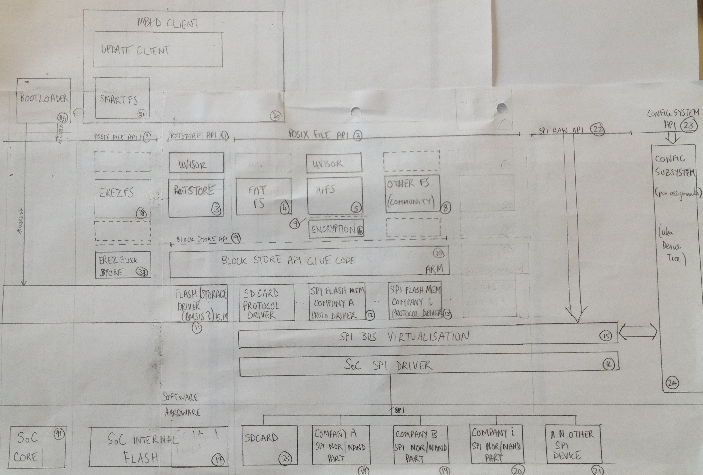

# mbed Storage Product Requirements

Contributors: Simon Ford, Sam Grove, Simon Hughes, Erez Landau, Marcus Shawcroft

Author: Simon Hughes

Document Version: 0.01

Date: 20161201

Status: DRAFT

#  Introduction

This aim of this document is to articulate the mbed storage product requirements.

# Overview 

The mbed storage endpoint functionality is envisaged to be partitioned into to the following functional components:

- NVStore. This is an "updatable", internal (on-chip, 16kB data) storage facilty for the 128bit root of trust key, and other minimal functionality that can be implemented on 99% of IoT devices.
- Filesystem Store (FAT32). This is a "read-write" general purpose storage facility on external SDCards.
- Filesystem Store High Integrity Filesystem (HIFS). This is a "read-write" general purpose storage facility with robustness enhancements principally for SPI-NOR and SPI-NAND support, for example.

The feature cut between above components is described in the table below.

**Storage Component Feature Analysis**

<table>
<thead>
<tr>
  <th>Feature</th>
  <th>NVStore</th>
  <th>Filesystem Store (FAT32)</th>
  <th>Filesystem Store (HIFS)</th>
</tr>
</thead>
<tbody>
<tr>
  <td>Security</td>
  <td>Is secure and must run in a security context (uvisor)</td>
  <td>?</td>
  <td>Is secure and should run in a security context (uvisor)</td>
</tr>
<tr>
  <td>Security</td>
  <td>Stores root of trust key</td>
  <td>?</td>
  <td>Does not store root of trust key</td>
</tr>
  <td>Security</td>
  <td>May not be encrypted.</td>
  <td>?</td>
  <td>Must be encrypted if held on off-chip storage.</td>
</tr>
<tr>
  <td>Endurance</td>
  <td>Written 10-100 times during product lifetime (1 time/year-1 time/month)</td>
  <td>?</td>
  <td>Written 10^5-10^6 times during product lifetime (10+ times/day)</td>
</tr>
<tr>
  <td>Physical Location</td>
  <td>Should be on-chip</td>
  <td>?</td>
  <td>Should be off-chip</td>
</tr>
<tr>
  <td>Physical Location</td>
  <td>On-chip is NOR flash with 
  NAND like restrictions due to flash memory controller.</td>
  <td>?</td>
  <td>A key use case is SPI NOR flash as the storage backend.</td>
</tr>
<tr>
  <td>Physical Location</td>
  <td>?</td>
  <td>?</td>
  <td>A key use case is SPI NAND flash as the storage backend.</td>
</tr>
<tr>
  <td>Physical Location</td>
  <td>?</td>
  <td>?</td>
  <td>A key use case is SPI SDCard/MMC as the storage backend.</td>
</tr>
<tr>
  <td>Wear Levelling</td>
  <td>Not required due to 
  small number of write/erase operations</td>
  <td>?</td>
  <td>Required due to large number of writes/erase operations</td>
</tr>
<tr>
  <td>EEC</td>
  <td>Error Correction Codes (ECC) not required 
  due to stability of storage</td>
  <td>?</td>
  <td>Error Correction Codes (ECC)  required due to instability of NAND storage (NAND is a key use case).</td>
</tr>
<tr>
  <td>Bad Block management</td>
  <td>Required.</td>
  <td>?</td>
  <td>Required.</td>
</tr>
<tr>
  <td>Robustness against power failures</td>
  <td>Required.</td>
  <td>?</td>
  <td>Required.</td>
</tr>
<tr>
  <td>Journaling</td>
  <td>Required for robustness against power failures.</td>
  <td>?</td>
  <td>Required for robustness against power failures.</td>
</tr>
<tr>
  <td>Sequential Writes</td>
  <td>NAND: sequential writing required 
  (no rewriting of previous journaled entries).</td>
  <td>?</td>
  <td>NAND: sequential writing required (no rewriting of previous journaled entries).</td>
</tr>
<tr>
  <td>API</td>
  <td>API: Should be the POSIX file interface, may be something different.</td>
  <td>?</td>
  <td>API: Must be the POSIX file interface.</td>
</tr>
<tr>
  <td>System Impact</td>
  <td>Storage operations may be invasive/disruptive to the system.</td>
  <td>?</td>
  <td>Storage operations must not be invasive or disruptive to the system.</td>
</tr>
<tr>
  <td>System Impact</td>
  <td>Storage operations may disable interrupts (causing high interrupt latency).</td>
  <td>?</td>
  <td>Storage operations must not disable interrupts.</tr>
</tr>
<tr>
  <td>System Impact</td>
  <td>Storage operations may require a system reboot after an operation</td>
  <td>?</td>
  <td>Storage operations must not require a reboot after an operation.</td>
</tr>
<tr>
  <td>System Impact</td>
  <td>Storage operations may use in-application programming techniques (use of RAMFUNCS).</td>
  <td>?</td>
  <td>Storage operations should not be use in-application programming techniques.</td>
</tr>
<tr>
  <td>System Impact</td>
  <td>Concurrent storage operations may have a very small number of file (or file equivalent) entities open concurrently e.g. maximum 2.</td>
  <td>?</td>
  <td>Concurrent storage operations may have a small number of file (or file equivalent) entities open concurrently e.g. maximum 10 (configurable).</td>
</tr>
<tr>
  <td>Portability</td>
  <td>Required. Must be capable of being ported to 99% of all IoT devices.</td>
  <td>?</td>
  <td>Required. Must be capable of being ported to 99% of all IoT devices.</td>
</tr>
  <td>Portability (Minimal Resources)</td>
  <td>Must need minimal system resources so NVSTORE can be implemented on the smallest of devices e.g. 2-4kB SRAM and 10-15kB code flash.</td>
  <td>?</td>
  <td>May require more than minimal system resources e.g. >4kB SRAM, SRAM footprint scaling linearly with store size and number of files,  >>15kB code flash.</td>
</tr>
<tr>
  <td>mbedOS Native Support</td>
  <td>Required.</td>
  <td>?</td>
  <td>?</td>
</tr>

</tbody>
</table>

# Product Requirements On OS Driver Architecture

**Figure 1. OS Driver Architecture for describing product requirements on silicon parnter and flash memory vendor contributed software components.**

The figure above show the following entities :

- (1) NVStore API (ARM-SW). This could be a minimal POSIX API, or a simple as a get()/set() interface for getting/setting the 128bit key.
- (2) POSIX File System API (ARM-SW). This is the general purpose POSIX file system API (or a subset thereof) which will be used for access the file system components.
- (3) NVStore (ARM-SW). The "updatable", internal (on-chip, 16kB data) storage facilty for the 128bit root of trust key.
- (4) FAT32 Filesystem (ARM-SW). This is the "read-write" filesystem for mounting of SDCard backends (with transparent bad block management, wear-levelling and ECC).
- (5) High Integrity Filesystem (ARM-SW). This is the "read-write" filesystem for mounting on SPI-NOR or SPI-NAND backends. The FS includes robustness features, bad block management, wear-levelling and ECC for example.
- (6) Filesystem Encrytion/Decryption Layer. 
    - This takes blocks from the overlying filesystem and encypts them before store the same size block on the flash. 
    - This component retrieves requested encrypted) blocks from the flash, decrypts them and forwards to the filesystem. 
    - This component will use the key in the NVStore for the cryptographic operations.
- (7) Block Store API(ARM-SW). This API is the same as (9) Block Store API but appears here as the top edge of the Filesystem Encrytion/Decryption Layer. See (9) for details.
    - `blkstr_write_page_fn` encrypts the block and forwards to the underlying Block Store API `blkstr_write_page_fn` for storing on flash.
    - `blkstr_read_page_fn` retrieves the encrypted block using the underlying Block Store API `blkstr_read_page_fn method`, decrypts and forwards to the overlying filesystem.
- (8) Other Filesystem (Community)(OTHER-SW). This is another filesystem that can be implemented by the mbedOS community, or ported by an ecosystem FS provider. 
- (9) Block Store API (ARM-SW). This will typically include the following operations:
    - `int (*blkstr_write_page_fn)(struct dev_t *dev, int pageId, char* data, size_t len, other params)`. Write a page (chunk of data e.g. 512bytes) within a block (e.g.4kB sector) where the offset is specified by the pageId.
    - `int (*blkstr_read_page_fn)(struct dev_t *dev, int pageId, char* data, size_t len, other params)`. Read a page (e.g. 512bytes) from a block where the offset is specified by the pageId.
    - `int (*blkstr_erase_block_fn)(struct dev_t *dev, int blockId)`. Erase the block i.e. the sector.
    - `int (*blkstr_mark_bad_block_fn)(struct dev_t *dev, int blockId)`. Mark the whole block (i.e. sector) identified by the blockId as bad i.e. put identifying code in sector or OOB area.
    - `int (*blkstr_init_fn)(struct dev_t *dev)`. Initialise use of device.
    - `int (*blkstr_deinit_fn)(struct dev_t *dev)`. Deinitialise use of device.
- (10) OS Block Store Glue Code (ARM-SW).
- (11) Flash Driver/Storage Driver (SiP-SW).
- (12) SPI Flash Memory Protocol Driver from Company A (FMPV-SW).
- (13) SPI Flash Memory Protocol Driver from Company B (FMPV-SW).
- (14) SPI Flash Memory Protocol Driver from Company i (FMPV-SW).
- (15) SPI Bus Virtualisation (ARM-SW).
- (16) SoC SPI Driver (SiP-SW)
- (17) SoC Internal Flash Hardware.
- (18) Company A SPI NOR/NAND Flash Memory Part Hardware.
- (19) Company B SPI NOR/NAND Flash Memory Part Hardware.
- (20) Company i SPI NOR/NAND Flash Memory Part Hardware.
- (21) Company j SPI device or arbitrary type sharing the SPI bus with the NOR/NAND parts.
- (22) RAW SPI Interface. 
- (23) Board/SoC/Device Configuration System inteface.
- (24) Configuration Subsystem. 

Terminology:

- ARM-SW. Software component implemented by ARM, and an API specified by ARM.
- SiP-SW. Software component implemented by Silicon Partner.
- FMPV-SW. Software component implemented by Flash Memory Part Vendor.
- OTHER-SW. Software component implemented by mbed community, or 3rd party ecosystem vendor.

notes to self:

- sketch out block API, flash memory driver API, FS API somewhere to make the discussion concrete.

