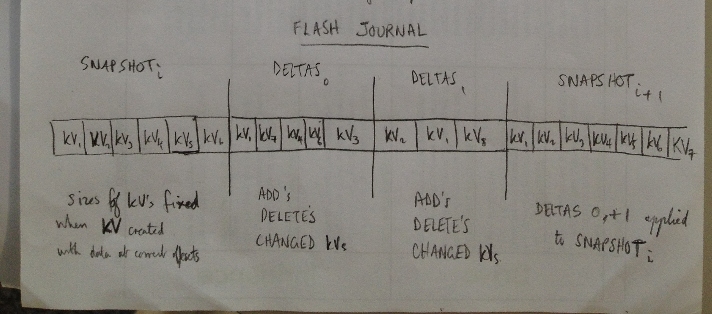

# Configuration Store High Level Design For Removing SRAM Limitation

Author: Simon Hughes

Document Version: 0.01

Date 20161110

# Overview

This document describes the CFSTORE high level design to remove the SRAM Limitation.

- The current CFSTORE has a HLD. This document is a delta to that document.
- The current design uses a heap, which is too impactful wrt to SRAM usages.
- Cant take full advantage of the available flash storage because of SRAM usage.

# Goals of design:

- to reduce the SRAM footprint to 2-4kB
- for SRAM usage to be bounded, i.e. statically allocated data structures rather than using the heap.
- to make the implementation capable using a large flash store without increasing 
- to be robust against failures i.e. the stored data should always be left in a recoverable state should
  power be lost or a software reset occurs during a flash write operation.

# Design Overview

  

- The design uses a new Flash Journal alogorithm (strategy) (insert picture from jpg for 20161109_1):
    - algorithm will have N slots e.g. 4 slots.
    - Slots are of 2 types:
        - Snapshot Slot. This slot contains a complete record of all the KVs in a TLV array
          (linked list). A snapshot slot may only contain 
        - Delta Slot. These are changes are with reference to the previous snapshot 
          recording KV adds, deletes and changes to KV data. Deltas are fixed size blocks 
          of the same size as the KVBUF. This is so that KVBUFs in the delta snapshot 
          occur at designated boundaries. toto: in next revision relax this constraint e.g. with the following changes:
            - relax the constraint that the delta TLV is fixed size of 256 bytes.
            - the delta TLV is of minimum of program unit bytes in size.
            - have a cookie field in the header.
            - the delta slot is used as a ring buffer.
            - rather than the first delta TLV start at a random location selected from one of the (sizeof delta slot)/(sizeof fixed delta TLV block ~256bytes) locations, 
              have N~(sizeof delta slot)/(sizeof KVBUF) so N~64 predefined possible locations.
            - one subslot position is selected at random when writing the first KV to a delta slot. 
            - The location of the first TLV in a delta slot is caches in 
            to find the first delta TLV 
    - The scheme permits the current state of an open KV to be recreated in memory when required to do so e.g. when a KV 
    - Slot boundaries are aligned to sector boundaries.
    - Slots can be of different sizes. It's advantageous for snapshot slots to be larger than
      delta slots (e.g. snapshot slot = 256kB, delta slots = 16kB) because:
        - the mapping of this scheme is better for devices with mixed block sizes e.g. STM devices with 4x16kB, 3x64kB, 1x128kB, 1x256kB.
          as small sectors can be used for the deltas, and the large sectors can be used to store the entirety of the snapshot data.
        - its desireable that the snapshot slots use the large sectors so the total amount of stored data can be large e.g. 256kB.
    - the first delta block writing in a slot is written at a random location within the slot so as not to excessively wear the 
      flash at the start of the associated sector. To do this: 
        - delta blocks have a flag indicating this is the first one to be written in the delta slot.
        - delta blocks are of fixed size e.g. KVBUF, multiple of the program unit. They delta slot can be searched 
          from the start of the slot by looking for the looking for the first delta TLV flag at the 
          boundaries which 
    
    - Before returning 

- The design supports the simultaneous rw access of n clients to the same KV. Access to the underlying flash representating of the KV value data and state.
    

### KV Buffers
    
- For an open KV, there is an associated statically allocated SRAM staging buffer (KVBUF). The KVBUF is needed for queue-buffering read/write transactions. 
  CMSIS storage driver transactions have to be serialised i.e. an outstanding transaction has to 
  completed before another transaction can be requested. The KVBUF is therefore used to buffer context data for a pending storage driver transaction until it can be 
  issued/completed with the the storage driver.
- For example, the KV SRAM buffer (KVBUF) may be ~256bytes, and there may be ~8 buffers (limiting the maximum number pending transaction to 8).
  So the typical SRAM footprint is ~2kB. Dimensioning of the SRAM buffer should take into account:
    - the size of the flash optimal program unit (1024 bytes on K64F)
    - the size of the flash program unit (8 bytes on K64F) i.e. the KVBUF size should be a multiple of the program unit.
    - The total SRAM footprint.
    - The maximum number of concurrently open KVs (this doesnt have to be the case if all data is stored on flash necessary to re-create the open KV state).
      The number of KVBUFs then just restricts the number of concurrent accesses from clients.
- Each KV SRAM buffer has the following associated data items:
    - read location.
    - write location.
    - reference count (no, this has to be bound to *the* one and only representation of the KV value data).

### Synchronous Mode of Operation
 

# Format of Key Value Attvibute TLVs   

### Overview

The format of the TLVs representing KVs is as follows:

- Header of fixed size including version, type, length and CRC information. The header is of a fixed format and fixed length.
- A data payload appending immediately after the header.
- Padding appended immediately after the payload, to align the on-flash representating to a program unit boundary.

TLVs are of 2 types:

- Snapshot TLVs. This records a full representation of the KV data including:
    - Header including the unique KV identifier KVID.
    - key value name.
    - value data.
- Delta TLVs. This records a change (delta) to an existing KV or the addition/deletion of a TLV, for example. The TLV data incluedes:
    - Header including the unique KV identifier KVID.
    - The delta operation being performed:
        - Add KV.
        - Delete KV.
        - Rseek read location.
        - Write KV.
        - Open KV.
        - Close KV.
    - Optionally, write data for a write operation.
    

### General Format of KV Header

The fields of the KV header include the following:

- Version field (~4 bits) indicating version of TLV header and data format.
- Type field (~2 bits) 
    - Type 1 indicates a snapshot TLV which includes the key name and the value data.
    - Type 2 indicates a delta TLV, of fixed sized (e.g. 256 bytes), which only holds value data write operations, or delete actions.
- Flags (n bits). The flags can indicate the following properties
    - rwx permissions of the attribute.
    - Delta TLV Add bit. If set, this is a delta TLV for adding a new KV, and the TLV data contains the key name.
    - Delta TLV Delete bit. If set, this is a delta TLV for deleting a pre-existing KV. The KV is indentified using the KV ID field. This operation decrements the KV reference count. 
    - Delta TLV Open bit. If set, this is a delta TLV for opening a pre-existing KV. The KV is indentified using the KV ID field. This operation increments the KV reference count. 
    - Delta TLV Rseek bit. If set, this is a delta TLV for seeking the read location on a pre-existing KV. The KV is indentified using the KV ID field. 
    - Delta TLV Write bit. If set, this is a delta TLV for writing the value data of a pre-existing KV. The KV is indentified using the KV ID field.
    - Delta TLV Wseek bit. If set, this is a delta TLV for seeking the write location on a pre-existing KV. The KV is indentified using the KV ID field. 
    - Delta TLV First bit. If set, this is the first delta TLV to be written in a delta slot. See later for further details.
    - (check for other flags in the pre-existing implementation).
- Length (32 bits). Length of the data payload that follows the header. 
    - For a Delta TLV Add operation, this is the length of the key name string (max 220 chars).
    - For a Delta TLV Delete operation, this is 0.
    - For a Delta TLV Write operation, this is the length of the value data
- Offset (32 bits). Present for Delta TLV Write operation, otherise set to 0. This is the write location offset from the start of the KV value data.
- KVID (32 bits). A unique indentifier for a KV. The Delta TLV Add operation binds a KVID to a key name. The KVID is also present with the full KV representation in the snapshot TLV.
- CRC (32 bits). CRC over the TLV header and payload. For calculating the CRC this field assumes the value 0.

#### Delta TLV First bit

todo: this section describes the operation of the Delta TLV First bit

- A Scheme for minimizing wear at the start of a slot.
- delta slot used as a ring buffer of delta TLVs.

        
### Read Operations

#### Asynchronous Mode Read Operation
    
The async KV read operation would proceed as follows:

- On a KV open for read-only access, a KVBUF is attached to the KV file descriptor.
- The KV is found in the lastest snapshot and the value data read into the KVBUF.
- The delta snapshots subsequent to latest snapshot are searched and applied to the KVBUF to yield the current state of the KV value data.
- 

### Notes

- With this scheme it seems possible to support the write location.
