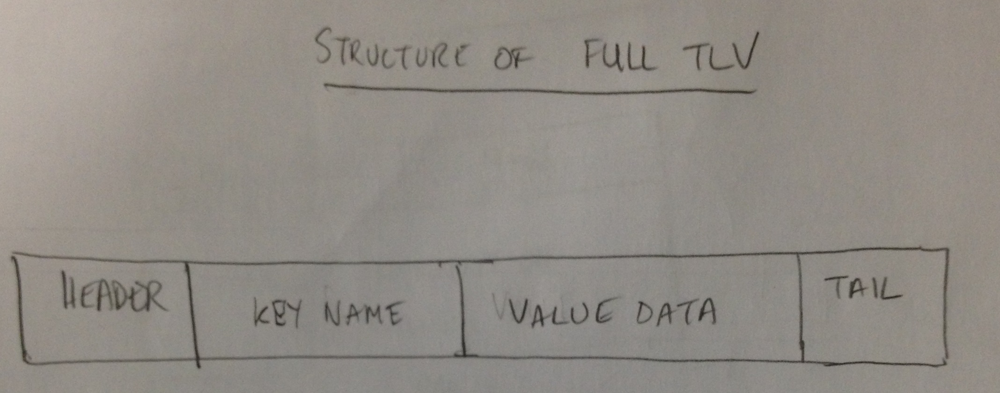
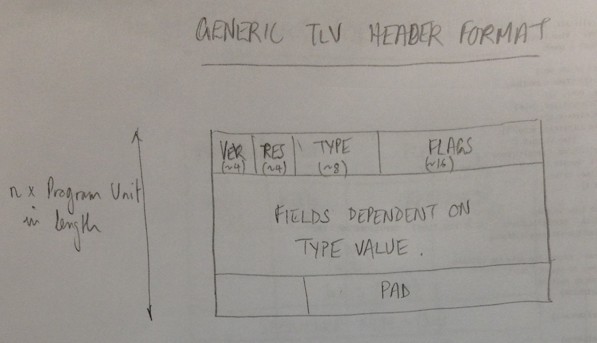
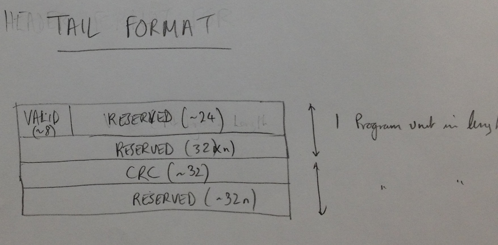
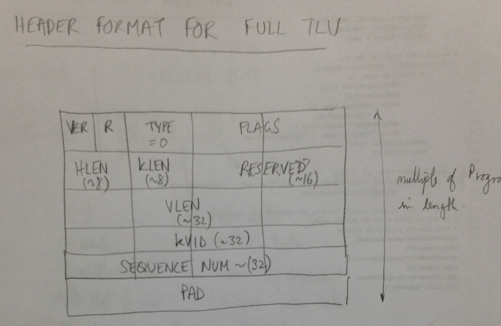
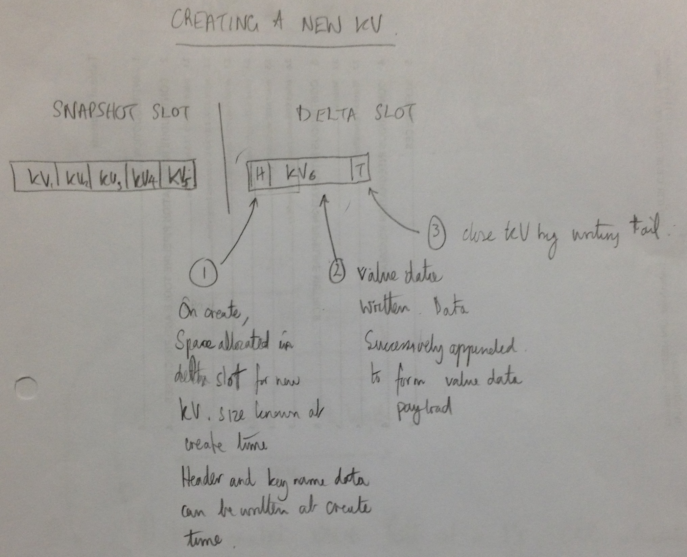
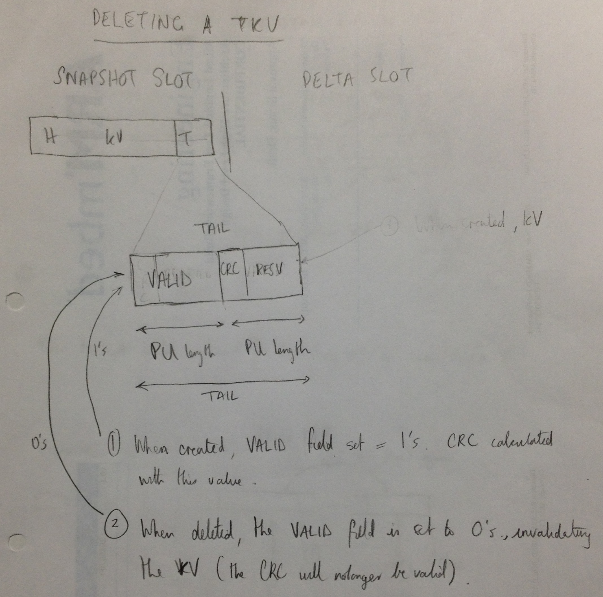
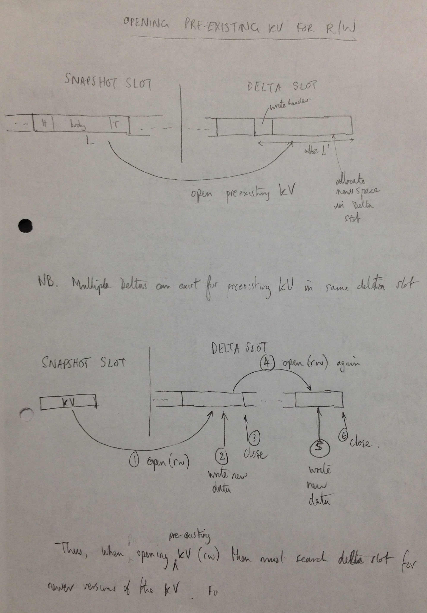
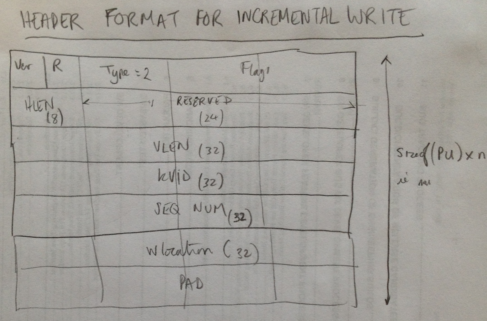

# Configuration Store High Level Design: Design For Removing SRAM Limitation

Contributors: Sam Grove, Rohit Grover, Simon Hughes, Erez Landau, Milosch Meriac

Author: Simon Hughes

Document Version: 0.01

Date: 20161116

Status: DRAFT

# <a name="introduction"></a> Introduction

## <a name="overview"></a> Overview

This document describes the CFSTORE High Level Design (HLD) to remove the SRAM Limitation.

- There is a pre-existing CFSTORE [HLD for the API design][CFSTORE_HLD]. Please refer to that document before reading this document.
- The current document describes a new HLD for the implementation of the API requiring minimal SRAM.
    

## <a name="cfstore-current-design-and-implementation-status"></a> CFSTORE Current Design and Implementation Status

The current CFSTORE design and implementation uses the system heap to store a full image of all stored Key Value (KBV) attributes prior to committing to the NV store. 

- When the CFSTORE Flush() operation is performed, the SRAM image is copied to NV store.
- When the CFSTORE Initialize() operation is performed, the NV store KV data image is loaded into SRAM which is allocated when the size of the NV store image is determined.
- When the CFSTORE Uninitialize() operation is performed, the heap memory is deallocated back to the system.
- When the CFSTORE Read() operation is performed, KV data is read from the SRAM image.
- When the CFSTORE Write() operation is performed, KV data is written to the SRAM image.
- Changes to the KV SRAM image (e.g. through write() operations) must be persisted to the NV store using the flush() operation prior to the calling of Uninitialize(), otherwise the changes will be lost.

The limitations of the above scheme are as follows:

- System heap usage is unbounded, and will continue to grow until the system runs out of memory. 
- System heap usage grows as the total size of stored data grows.
- The size of NV store used is limited to the available SRAM that can be dedicated to CFSTORE usage. For example, if 32kB of SRAM is dedicated to CFSTORE KV image use, then only 32kB of the NV store can be used.
  (Note, a larger NV store footprint will occur as Flash Journal uses additional NV storage to maintain multiple versions of attributes).


## <a name="goals-of-the-new-design"></a> Goals of the New Design

The goals of the new design are as follows:

- To reduce the SRAM footprint to 2-4kB.
- For SRAM usage to be bounded, i.e. the implementation should use statically allocated data buffers rather than using the heap.
- To be capable of using a large flash store without being restricted by the amount of SRAM dedicated to CFSTORE.
- To be robust against failures i.e. the stored data should always be left in a recoverable state should a 
  power loss or a software reset occur during a flash write operation.

## <a name="document-structure-and-layout"></a> Document Structure and Layout

The layout of the document is described in this section.

The first chapter of the document provides an [introduction](#introduction) describing a summary [overview](#overview), 
the [status of the current design](#cfstore-current-design-and-implementation-status) and the [goals of the new design](#goals-of-the-new-design).
The chapter also includes [outstanding issues](#outstanding-issues) with this document and the [terminology](#terminology) used throughout the document.

The next chapter describes the [basic design](#basic-design-overview) features which minimise the use of SRAM, beginning with an overview of the [CFSTORE storage software stack](#cfstore-storage-software-stack).
The design uses a [modified version of the flash journal](#kvs-are-stored-using-modified-flash-journal) to store key value attributes in a [Type Length Value (TLV) representation](#tlv-structure).
The TLV format is described in detail including a description of the [generic header format](#kv-tlv-generic-header), the [TLV tail](#kv-tlv-generic-tail) and the [KV full TLV representation](#kv-tlv-header-type-1).

The next chapter describes the [CFSTORE API operations](#cfstore-operation) with respect to the basic design:

- [Section 1](#storage-of-kv-read-write-locations-and-reference-counting) describes how the KV read and write locations are stored in the KV hkey descriptor, and how reference counting operations are implemented.
- [Section 2](#creating-a-new-kv) describes how a new KV is created in NV store.
- [Section 3](#deleting-a-kv) describes how a KV is deleted my resetting the VALID field in the tail to a non-erase value.
- [Section 4](#opening-an-existing-kv-for-reading) describes how an existing KV is opened for reading, and how data is read from NV store.
- [Section 5](#opening-an-existing-kv-for-reading-writing) describes how an existing KV is opened for reading and writing, and how data is written to NV store.
- [Section 6](#flush-operation) describes how the CFSTORE Flush() operation creates of a new snapshot of all valid TLVs, collecting garbage in the process.
- [Section 7](#synchronous-mode-of-operation) describes how the design implements a synchronous mode of operation.
- [Section 8](#asynchronous-mode-of-operation) describes how the design implements an asynchronous mode of operation.
- [Section 9](#static-sram-buffers-kvbufs) describes the SRAM requirements to implement the design. SRAM is not required for read and write transactions per-se (as client buffers are provided), 
  but SRAM is required for queueing transactions from multiple clients.
- [Section 10](#error-handling) describes error handling.

The next chapter describes [feature enhancements](#enhanced-design-features) to the basic design:


- [Section 1](#write-location-seek-support) describes the Type 2 TLV representation for incremental writes used to implement write location seeking.
- [Section 2](#wear-levelling) describes the wear level algorithm.


The final chapter lists useful [references](#references) to this document.


## <a name="outstanding-issues"></a> Outstanding Issues With This Document

The following lists the outstanding issues with this document:

- The [error handling](#error-handling) design requires definition.
- The [wear levelling](#wear-levelling) design requires defintion.
- PAL aligmnment is required including:
    - Storage of private keys.
    - Factory KVs and associated behaviours.
    

## <a name="terminology"></a> Terminology

The following terms are used extensively throughout this document.

- CFSTORE: Configuration Store.
- HLD: High Level Design.
- KV: Key Value.
- PU: Program Unit. This is the minimum size data block write that can be programmed into a sector (e.g. the K64F PU size = 8 bytes).
- TLV: Type Length Value.

Please refer to CFSTORE [terminology document][CFSTORE_TERM] for a full list of definitions. 

# <a name="basic-design-overview"></a> Basic Design Overview


## <a name="cfstore-storage-software-stack"></a> CFSTORE Storage Software Stack


```

                         Portable mbed Cloud                                     Platform OS 
                           Software Stack                                        (e.g. mbedOS)
                         ==================                                      Integration
                                                                                 ============= 

    +-+-+-+-+-+-+-+-+-+-+-+-+-+-+-+-+-+-+-+-+-+-+-+-+-+-+-+-+-+-+-+-+-+-+
    | mbed Cloud Client                                                 |
    |  +-+-+-+-+-+-+-+-+-+-+-++-+  +-+-+-+-+-+-+-+-+                    |
    |  |  Provisioning Client   |  |  mbed Client  |                    |
    |  +-+-+-+-+-+-+-+-+-+-+-++-+  +-+-+-+-+-+-+-+-+                    |
    |                                                                   |
    |  +-+-+-+-+-+-+-+-+  +-+-+-+-+-+-+-+-+-+  +-+-+-+-+-+-+-+          |    
    |  | Thread Stack  |  |  Update Service |  | mbedTLS     |          |                               
    |  +-+-+-+-+-+-+-+-+  +-+-+-+-+-+-+-+-+-+  +-+-+-+-+-+-+-+     (20) |    
    +-+-+-+-+-+-+-+-+-+-+-+-+-+-+-+-+-+-+-+-+-+-+-+-+-+-+-+-+-+-+-+-+-+-+    
      
                                --- CFSTORE C-HAL3 Interface/PAL (18) ---     -- OS CFSTORE API (19) --
                                                                            
                                +-+-+-+-+-+-+-+-+-+-+-+-+-+-+-+-+-+-+-+-+    +-+-+-+-+-+-+-+-+-+-+-+-+
                                |    Security Layer (uvisor) (16)       |    | Platform-OS CFSTORE   |
                                +-+-+-+-+-+-+-+-+-+-+-+-+-+-+-+-+-+-+-+-+    | Wrapper (17)          |  
                                                                             +-+-+-+-+-+-+-+-+-+-+-+-+
                                                                            
    ------------------- CFSTORE C-HAL2 Interface (15) ------------------------------------------------ 
                                                                            
    +-+-+-+-+-+-+-+-+-+-+-+-+-+-+-+-+-+-+-+-+-+-+-+-+-+-+-+-+-+-+-+-+-+-+  
    |             Configuration Store (CFSTORE) Mux/Demux (14)          |  
    +-+-+-+-+-+-+-+-+-+-+-+-+-+-+-+-+-+-+-+-+-+-+-+-+-+-+-+-+-+-+-+-+-+-+  
                                                                            
    -------------------- CFSTORE CMSIS C-HAL Interface (13) -------------  
                                                                           
    +-+-+-+-+-+-+-+-+-+-+-+-+-+-+-+-+-+-+-+-+-+-+-+-+-+-+-+-+-+-+-+-+-+-+  
    |                      Configuration Store (12)                     |  
    +-+-+-+-+-+-+-+-+-+-+-+-+-+-+-+-+-+-+-+-+-+-+-+-+-+-+-+-+-+-+-+-+-+-+  

    -- Storage_VM.h API (9) ---   ---- Flash_Journal.h API (10) ---------    --- OS SVM/FJ API (11) --

    +-+-+-+-+-+-+-+-+-+-+-+-+-+-+-+-+-+-+-+-+-+-+-+-+-+-+-+-+-+-+-+-+-+-+    +-+-+-+-+-+-+-+-+-+-+-+-+
    | Flash Journal (FJ) (5)                                            |    | Platform-OS FJ Wrapper| (6)   
    +-+-+-+-+-+-+-+-+-+-+-+-+-+-+-+-+-+-+-+-+-+-+-+-+-+-+-+-+-+-+-+-+-+-+    +-+-+-+-+-+-+-+-+-+-+-+-+
     
    +-+-+-+-+-+-+-+-+-+-+-+-+-+-+-+-+-+                                      +-+-+-+-+-+-+-+-+-+-+-+-+
    | Storage Volume Manager (SVM) (7)|                                      |Platform-OS SVM Wrap   | (8)
    +-+-+-+-+-+-+-+-+-+-+-+-+-+-+-+-+-+                                      +-+-+-+-+-+-+-+-+-+-+-+-+

    ------ Storage Driver API (CMSIS Storage Driver Interface) (3) ------    --- OS Storage API (4) --
    
    +-+-+-+-+-+-+-+-+-+-+-+-+-+-+-+-+-+-+-+-+-+-+-+-+-+-+-+-+-+-+-+-+-+-+    +-+-+-+-+-+-+-+-+-+-+-+-+
    | Storarge_Driver (1) e.g.                                          |    | Platform-OS           |
    |  - ARM_Driver_Storage_MTD_K64F                                    |    | Storage Driver        |
    |  - ARM_Driver_Storage_MTD_SDCard                                  |    | Wrapper (2)           |
    +-+-+-+-+-+-+-+-+-+-+-+-+-+-+-+-+-+-+-+-+-+-+-+-+-+-+-+-+-+-+-+-+-+-+    +-+-+-+-+-+-+-+-+-+-+-+-+

    SW
    -----------------------------------------------------------------------------------------------------
    HW
    
```

**Figure 1. CFSTORE Storage Software Stack.**

The above figure illustrates the various software components in teh CFSTORE storage stack.

- (1) Storage Driver. This is the implementation of the NV storage device driver.
- (2) Platform OS Storage Driver Wrapper. This encapsulates the Storage Driver for integration within a Platform OS.
- (3) Storage Driver API (CMSIS Storage Driver Interface). This is the portable storage driver API equating to the CMSIS Storage Driver Interface agreed with Kiel. 
- (4) Platform OS Storage API. This is the Platform OS storage driver API (optionally present).
- (5) Flash Journal (FJ). This is the Flash Journal implementation which provides an abstraction from the underlying flash geometry, and the requirement to erase a sector prior to programming with new data.
- (6) Platform OS Flash Journal Wrapper. This is the platform OS Flash Journal wrapper implementation (optionally present).
- (7) Storage Volume Manager. This is the storage volume manager which creates virtual partitions from a physical storage device so higher layer entities can share the device. 
- (8) Platform OS Storage Volume Manager Wrapper. This is the platform OS encapsulation of the storage volume manager (optionally present).
- (9) Storage Volume Manager API(Storage_VM.h). This is the portable API for the Storage Volume Manager. 
- (10) Flash Journal (Flash_Journal.h) API. This is the portable API for the Flash Journal.
- (11) Platform OS Storage Volume Manager/Flash Journal Wrapper API. This is the platform OS encapsulation of the storage volume manager and flash journal APIs (optionally present).
- (12) Configuration Store. This is the implementation in C of the configuration store. 
- (13) CFSTORE CMSIS C-HAL Interface. This is the portable CFSTORE interface (CMSIS aligned C-HAL).
- (14) Configuration Store (CFSTORE) Mux/Demux. This entity multiplexes/demultiplexes the calls from multiple overlying CFSTORE clients to the single user context of the underlying CMSIS layer. 
- (15) CFSTORE C-HAL2 Mux/Demux Interface. This is the portable API to the CFSTORE Mux/Demux.
- (16) Security Layer (uvisor). This is used to provide security for lower layers of the software stack (secure box/context).
- (17) Platform-OS CFSTORE Wrapper. This entity provides the CFSTORE integration with the Platform OS (optionally present). 
- (18) CFSTORE C-HAL3 Interface. This is the portable interface to the secure CFSTORE. It is thought to be synonymous with the Portable Abstraction Layer (PAL)
- (19) OS CFSTORE API. This is the platform OS encapsulation of CFSTORE (optionally present).
- (20) mbed Cloud Client. This entity is the integration of the provisioning client, mbed client and the update service, for example. 


## <a name="kvs-are-stored-using-modified-flash-journal"></a> KVs Are Stored Using A Modified Flash Journal


**Figure 2. Flash Journal (modified) is used to support slots of different types and sizes.**

- The design uses a new Flash Journal algorithm (strategy) (see the above figure):
    - KVs are stored as TLVs (similar to a linked list structure) within a slot.
    - The algorithm will have N slots e.g. 4 slots.
    - Slots are of 2 types:
        - Snapshot Slot. This slot contains a complete record of all the KVs in a TLV array. The TLV format includes both the key name and value data in the data payload.
        - Delta Slot. This slot contains TLVs that have been modified since the creation 
          of the last snapshot. Modified KVs are recorded using the full TLV format. KVs that have not been modified are not represented in the delta slot.

    
```

       +-------------------------------+    ^
       |                               |    |
       |  Journal Header               |    |
       |  starts with generic header   |    |
       |  followed by specific header  |    |
       |                               |    |   multiple of program_unit
       +-------------------------------+    |   and erase-boundary
       +-------------------------------+    |
       |                               |    |
       |   padding to allow alignment  |    |
       |                               |    |
       +-------------------------------+    v
       +-------------------------------+
       | +---------------------------+ |    ^
       | |  slot header              | |    |
       | |  aligned with program_unit| |    |
       | +---------------------------+ |    |     slot 0
       |                               |    |     aligned with LCM of all erase boundaries
       |                               |    |
       |                               |    |
       |                               |    |
       |          BLOB0                |    |
       |                               |    |
       |                               |    |
       | +---------------------------+ |    |
       | |  slot tail                | |    |
       | |  aligned with program_unit| |    |
       | +---------------------------+ |    |
       +-------------------------------+    v
       +-------------------------------+
       | +---------------------------+ |    ^
       | |  slot header              | |    |
       | |  aligned with program_unit| |    |
       | +---------------------------+ |    |     slot 1
       |                               |    |     aligned with LCM of all erase boundaries
       |          BLOB1                |    |
       |                               |    |
       .                               .    .
       .                               .    .
  
       .                               .    .
       .          BLOB(N-1)            .    .
       |                               |    |
       | +---------------------------+ |    |     slot 'N - 1'
       | |  slot tail                | |    |     aligned with LCM of all erase boundaries
       | |  aligned with program_unit| |    |
       | +---------------------------+ |    |
       +-------------------------------+    v
 
```

**Figure 3. Current Flash Journal implementation slot layout on flash, showing journal meta-data (taken `from flash_journal_strategy_sequential.h`). 
The format will be changes in the new implementation.**


Slots have the following characteristics:
    
- Slot boundaries are aligned to sector boundaries.
- Slots have meta-data. There is a header at the start of the slot and a tail with CRC/HMAC at the end of the slot (the header and tail are shown in the figure above).
- Slots can be of different sizes. It's advantageous for snapshot slots to be larger than
  delta slots (e.g. snapshot slot = 256kB, delta slots = 16kB) because:
    - The scheme can accommodate devices with mixed block sizes more easily e.g. STM devices with 4x16kB, 3x64kB, 1x128kB, 1x256kB,
      as small sectors can be used for the deltas and the large sectors can be used to store a complete record of valid KVs.
    - It's desirable that snapshot slots use the large sectors so the total amount of stored data can be large e.g. 256kB.
- Slots can be made up of multiple smaller sectors. 
    - For example, on the K64F which has a 2kB sector size, a 256kB snapshot slot may be composed of 128x2kB sectors. 
    - The slot may be composed of a set of non-contiguous storage address ranges (blocks) rather than a continuous address range. This permits errored sectors to be taken out of service.
- Slots can be made up of 1 large sector. For example, the STM 429 has a 128kB sector which may be used for a snapshot slot.
- Slot sectors are erased at the start of use of the slot. 
- After the erase operation at the start of use, a delta slot will have multiple transactional writes appended to a delta slot. This means that for every erase operation, there can be many write
  operations extending the overall life of the sector beyond 1 erase per write.
    

        
## <a name="kv-storage-format"></a> KVs Storage Format

### <a name="tlv-structure"></a> TLV Structure


**Figure 4. Full TLV storage format for KV data.**

The above figure shows the format of the KV full TLV representation i.e. the format that includes both the key name and value data. This is composed of the following elements:

- Header of fixed size, padded so the last byte aligns with a program unit boundary. The header can  be written to flash independently of writing the preceding tail (if a prior TLV exists in the slot) and the following payload data.
- A data payload, padded so the last byte aligns with a program unit boundary. The payload can be written to flash independently of writing the preceding header and following tail. In the above figure, the payload is composed of:
    - Key name. This is the name of the KV attribute.
    - Value data. This is the value data bound to the key name.
- A tail of fixed size, padded so the last byte aligns with a program unit boundary. The tail can be written to flash independently of writing the preceding payload, and the following header of the next TLV (space permitting). 

Note also the following:

- TLVs are of variable length.
- TLVs can be of different types, as indicated by the header TYPE field.
- TLV fields for data types larger than a byte are written in big endian format (network byte order).
- TLVs may cross sector boundaries so that CFSTORE can support KV sizes larger than sector sizes.
- The start of the header, key name, value data and tail data structures on NV store must be aligned with PU boundaries, to facilitate the writing of the TLV components independently of one another.


### <a name="kv-tlv-generic-header"></a> KV TLV Generic Header


**Figure 5. TLV generic header format.**


The above figure shows the generic structure of the TLV header common to all KV TLV representations. The structure and field definitions are as follows: 

- VERSION (4 bits). This field indicates the version of TLV header and data format (version 1 is described in this document).
- RESERVED (4 bits). This field is reserved for future use.
- TYPE (8 bits). For example, TYPE = 1 indicates a full TLV representation which includes the key name and the value data in the payload. 
- FLAGS (16 bits). This field includes permissions, for example, and the definition of the flags is specific to the TLV type.
- Additional fields are present depending on the value of the TYPE field.
- PAD. The header is padded so the last byte aligns with a program unit boundary. This means the header can be written to flash independently of writing the preceding and following journal entries. 


### <a name="kv-tlv-generic-tail"></a> KV TLV Generic Tail


**Figure 6. KV TLV generic tail format.**

The above figure shows the TLV generic tail format including the following fields:

- VALID (8 bits). The valid value of the VALUE field is the value programmed after an erase operation. 
  In the case that the erase value is all bits set to 1 and the correct CRC for the TLV is present, then the TLV indicates the TLV is valid. 
  A value of 0x00 in this field would then indicate the TLV is invalid irrespective of the CRC. The delete operation sets the Valid field to the complement of the erase setting. 
  A value of 0x00 in this field would then indicate the TLV is invalid irrespective of the CRC. The delete operation sets the Valid field to the complement of the erase setting. 
  TLVs with the Valid field set to 0 are ignored.
- RESERVED1 (24 bits).  This field is reserved for future use.
- RESERVED2 (32n bits, for n >=0). This is padding so the Valid field sits within a program unit size block of NV store. The field is reserved for future use.
- CRC/HMAC (32 bits for CRC, 120, 256, 384, 512 bits for HMAC). This is the CRC/HMAC of the TLV. 
- RESERVED3 (32n bits). This is padding so the CRC field sits within a program unit size block of NV store. The field is reserved for future use.

Note, a tail length field TLEN may be added to the tail.


#### Message Authentication Codes as Alternative to CRCs

The benefit of using a HMAC signature depends on the threat model:

- Consider scenario A where HMAC use offers a benefit: 1) key being stored in fuse or HW security module, 2) CFSTORE storing data in on-chip flash. 
  The HMAC key is stored more securely than the protected data in on-chip flash and so the use of HMAC codes is beneficial.
- Consider scenario B where HMAC use offers a benefit: 1) key being stored in on-chip flash, 2) CFSTORE storing data in off-chip flash. 
  The HMAC key is stored more securely than the protected data in off-chip flash and so the use of HMAC codes is beneficial.
- Consider scenario C where HMAC use offers no benefit: 1) key being stored in on-chip flash, 2) CFSTORE storing data in on-chip flash. 
  The HMAC key is not being stored more securely than the protected on-chip data and so the use of HMAC codes is not particularly beneficial.

The design permits the use of HMAC codes rather than CRC values:

- The HMAC key that is kept securely in a fuse, or in the CFSTORE uvisor box.
- Options to consider: HMAC SHA-1 (120 bits = 20 bytes), HMAC SHA-256 (256 bits = 32 bytes), HMAC SHA-384 (384 bits = 48 bytes), HMAC SHA-512 (512 bits = 64 bytes), AES CMAC (? bits = ? bytes)
- Additional KV TLV types are defined where accompanying tails including HMAC codes:
    - TYPE = 3: tail with HMAC SHA-1 (120 bits = 20 bytes).
    - TYPE = 4: tail with HMAC SHA-256 (256 bits = 32 bytes).
    - TYPE = 5: tail with HMAC SHA-384 (384 bits = 48 bytes).
    - TYPE = 6: tail with HMAC SHA-512 (512 bits = 64 bytes).
    - TYPE = 7: tail with AES CMAC (? bits = ? bytes).

        
### <a name="kv-tlv-header-type-1"></a> KV TLV Header Type 1: Full TLVs


**Figure 7. TLV type 1 header format for the full TLV representation. Note the figure incorrectly shows TYPE = 0.**

The fields of the KV header include the following:

- The generic header fields as previously described in the [KV TLV Generic Header](#kv-tlv-generic-header) section.
- FLAGS (16 bits). This field is to be specified.
- HLEN (8 bits). This field specifies the length of the header.
- KLEN (8 bits). This field specifies the length of the key name field in the TLV payload. It is padded with 0's so the last byte aligns with a program unit boundary, 
  allowing the first part of the TLV (header and key name) to be written in NV store when created/opened for writing independently of the following payload.
- RESERVED1 (16 bits).  The field is reserved for future use.
- VLEN (32 bits). This field specifies the length of the KV value data field in the TLV payload.
- KVID (32 bits). This field is the unique identifier bound to the key name specified in TLV key name part of the payload. The KVID is used in other TLV types to identify a TLV without including the key name.
  The KVID is selected at create time and is unique within CFSTORE.
- SEQUENCE-NUMBER (32 bits). This is the KV version number which is incremented each time a new version of the KV is written. The implementation must take into account the possibility that 
  the sequence number counter can wrap. See the [wrapping of the sequence number](#wrapping-of-the-sequence-number) section for further details.
- PAD. The header is padded so the last byte aligns with a program unit boundary. 

The type 1 TLVs appear in both snapshot and delta slots.


#### <a name="kv-tlv-tail-type-1"></a> KV TLV Tail for Type 1 Headers

The tail accompanying a type 1 header uses a 32 bit CRC as shown in [KV TLV generic tail](#kv-tlv-generic-tail) section.


#### <a name="wrapping-of-the-sequence-number"></a> Wrapping of the SEQUENCE-NUMBER

The wrapping of the SEQUENCE-NUMBER field is handled in the following way:

- A header flag SEQUENCE-NUMBER-WRAPPED is defined to indicate the sequence number counter has wrapped.
- The system starts in "wrapped-mode-off".
- The maximum value of the sequence counter is 0xffffffff. When the value wraps to 0 "wrapped-mode-on" is entered. All TLVs created in wrapped-mode-on have the SEQUENCE-NUMBER-WRAPPED flag set.
- If the SEQUENCE-NUMBER-WRAPPED bit is set in a header then the SEQUENCE-NUMBER is interpretted as SEQUENCE-NUMBER += 0x0100000000 when comparing with other sequence numbers without the SEQUENCE-NUMBER-WRAPPED bit set.
- When all SEQUENCE-NUMBERs created prior to entering wrapped-mode-on have been removed from the system, "wrapped-mode-off" is entered.  All TLVs created in wrapped-mode-off have the SEQUENCE-NUMBER-WRAPPED flag reset.


## <a name="cfstore-operation"></a> CFSTORE Operations

### <a name="storage-of-kv-read-write-locations-and-reference-counting"></a> Storage of KV Read/Write Locations and Reference Counting

For each open KV descriptor (hkey), the opaque hkey buffer is used an implementation storage area:

- The hkey is used to store a `cfstore_file_t` data structure which includes the following attributes:
    - The KVID of the open KV.
    - The KV read location rlocation.
    - The KV write location wlocation.
- The `cfstore_file_t` instances are nodes in the linked list of open files (`file_list`). 
- When a KV is opened multiple times (e.g. by multiple clients each accessing the same KV) then multiple `cfstore_file_t` entries will appear in the `file_list` 
  with the same KVID.
- The `file_list` is used to generate a reference count of the number of open KV descriptors for a particular KV by counting the nodes with the same KVID appearing in the `file_list`.
  In the case that a client deletes a KV, the KV is only deleted when the last open KV descriptor using the KV is closed (i.e. remove from the `file_list`), and the reference count falls to 0.


### <a name="creating-a-new-kv"></a> Creating a New KV (CFSTORE Create() API Method)


**Figure 8. Creating a New KV.**

The above figure shows the operations performed to create a new KV.

- Consider the situation where the snapshot contains KVs {KV1, KV2, KV3, KV4, KV5} (see the figure above). 
- When CFSTORE Create() is called to create KV6, the key name and size of the KV are specified. 
    - A `cfstore_file_t` structure is initialised within the hkey buffer, and inserted into the `file_list`.
    - The size of the full TLV representation needed to store the KV is calculated from the supplied data i.e. `size = sizeof(header)+sizeof(tail)+key_name_length+value_data_length)`.
    - The space size for the KV TLV is allocated in the delta slot (see (1) in the figure above).
    - The header and the key name part of the payload are written.
- When CFSTORE Write() is called, the client supplies a data buffer and the length L of the data to be written (see (2) in the figure above).
    - CFSTORE writes the data to NV store. The supplied data should be padded to be a multiple of PU size (the minimum write size). If not CFSTORE 
      will write only a multiple of PU bytes, and report to the client that n < L bytes of data have been written.
- When the KV is closed the tail is written in the KV commit the data (see (3) in the above figure). 
    - The `cfstore_file_t` structure removed from the `file_list`.
- Once the KV has been closed it may be opened again for writing. This will cause a new version of the KV TLV to be created in the delta slot.


### <a name="deleting-a-kv"></a> Deleting a KV (CFSTORE Delete() API Method)


**Figure 9. Deleting a  KV.**

The above figure shows the operations performed to delete a KV.

- The last full TLV representation of the KV is found. When an existing KV is opened for deleting, the latest version of the TLV may be found in a snapshot or delta slot.
- The tail VALID field (previously set to the erase value during the last sector erase operation) is set to complement of the erase value (see (1) and (2) in the figure above). 
  The KV TLV then becomes invalid and will be ignored.
- At a suitable point during system operation (e.g. when a CFSTORE Flush() operation is performed) the previous snapshot slot and delta slot(s) are used to create a new snapshot slot. The new snapshot slot contains
  a full representation of all the valid TLVs not including the deleted TLVs. The old snapshot slot will be erased and used to create the next snapshot version at some future point in time. This scheme garbage
  collects the deleted TLVs at the expense of periodically consolidating valid KV TLVs in a snapshot image.
  

### <a name="opening-an-existing-kv-for-reading"></a> Opening an Existing KV for Reading (CFSTORE Open(Read-Only) API Method)

- For this operation, its not necessary to log any new entries in the delta slot.
- When an existing KV is opened for reading, the latest version of the TLV may be found in a snapshot or delta slot. The latest version will have a valid CRC/HMAC code and the latest SEQUENCE-NUMBER.
    - A `cfstore_file_t` structure is initialised within the hkey buffer and inserted into the `file_list`. The rlocation is set to 0.
- When the client performs a CFSTORE Read() operation, the KV data is read into the client supplied buffer from the location indicated by the current value of the rlocation position. 
    - The `cfstore_file_t` rlocation position is updated after receiving the data from the storage driver by the number of read bytes of data.
- When the client performs a CFSTORE Rseek() operation, the `cfstore_file_t`::rlocaton attribute is updated to the new position.
- Multiple readers can read the underlying KV TLV data simultaneously. Each client maintains a `cfstore_file_t::rlocaton` attribute independent of the other clients.
- When the client performs a CFSTORE Close() the `cfstore_file_t` structure is removed from the `file_list`.


### <a name="opening-an-existing-kv-for-reading-writing"></a> Opening an Existing KV for Reading/Writing (CFSTORE Open(RW) API Method)


**Figure 10. Opening an existing KV for reading/writing.**

- For this operation, a new version of the TLV is created in the delta slot.
- When an existing KV is opened for reading and writing, the latest version of the KV TLV is found. 
    - The latest version of the TLV may be found in the previous snapshot (see (1) in the above figure) or in a delta slot. The latest version will have a valid CRC/HMAC code and the latest SEQUENCE-NUMBER.
    - A `cfstore_file_t` structure is initialised within the hkey buffer (rlocation = 0, wlocation = 0) and inserted into the `file_list`.
    - The size of the full TLV representation needed to store the KV is calculated from the supplied data i.e. `size = sizeof(header)+sizeof(tail)+key_name_length+value_data_length)`.
    - The space size for the KV TLV is allocated in the delta slot. See (1) in the figure above which shows the opening of a pre-existing KV in a snapshot slot and the creation of the new full TLV representation in the delta slot.
    - The header and the key name part of the payload are written.
- When the client performs a CFSTORE Read() operation, the KV data is read into the client supplied buffer from the location indicated by the current value of the rlocation. 
    - The `cfstore_file_t` rlocation position is updated after receiving the data from the storage driver.
    - When the client performs a CFSTORE Rseek() operation, the `cfstore_file_t`::rlocaton attribute is updated.
- When CFSTORE Write() is called, the client supplies a data buffer and the length of the data to be written (see (2) in the above figure).
    - The `cfstore_file_t` wlocation position defaults to 0, and cannot be set with a seek operation. It is updated after writing data to storage.
    - CFSTORE writes the data to the NV store. The supplied data should be padded to be a multiple of PU size (the minimum write size). If not CFSTORE 
      will write only a multiple of PU bytes, and report to the client that n < L bytes of data have been written.
- Multiple readers/writers can read/write the underlying KV TLV data simultaneously. Each client maintains `cfstore_file_t`::wlocation attributes independently of the other clients.
- When the KV is closed the tail CRC/HMAC is written to commit the data (see (3) in the figure above). The previous version of the TLV is then invalidated by setting the tail VALID field to the complement of the erase value.
    - When the client performs a CFSTORE Close() the `cfstore_file_t` is removed from the `file_list`.
- Once the KV has been closed it may be opened for writing again. This will cause a new version of the KV TLV to be created in the delta slot (see (4) in the above figure).


### <a name="flush-operation"></a> Flush Operation (CFSTORE Flush() API Method)

The CFSTORE Flush() operation does the following:

- The current delta slot is committed by writing the tail of the Flash Journal slot.
- The oldest snapshot slot is erased in preparation for receiving the new snapshot data.
- The latest versions of valid KV TLVs are found in the latest snapshot and delta slots. A new version is written in the new snapshot in which there will be no deleted TLVs present.
- The new snapshot flash journal tail will be written, committing the snapshot data.


### <a name="synchronous-mode-of-operation"></a> Synchronous Mode of Operation.

The design supports a synchronous interface implementation. See the CFSTORE [HLD for the API design][CFSTORE_HLD] for more information.


### <a name="asynchronous-mode-of-operation"></a> Asynchronous Mode of Operation

The design supports an asynchronous interface implementation. See the CFSTORE [HLD for the API design][CFSTORE_HLD] for more information.


### <a name="static-sram-buffers-kvbufs"></a> Static SRAM Buffers (KVBUFs)

This design has the following implications regarding the SRAM footprint.
 
- SRAM is not required to support read/write transactions for the following reasons:
    - For a read operation, the ownership of the client read buffer (to receive data) is passed to CFSTORE until the transaction has been completed (either the read data returned, or an error indicated). 
      CFSTORE passes ownsership of the buffer (or part thereof) to the storage driver to receive the data. Once the data has been read into the buffer, the storage driver returns buffer ownership to CFSTORE, which returns it to the client.
    - For a write operation, the ownership of the client write buffer (with data to store) is passed to CFSTORE until the transaction has been completed (either the data has been written or an error indicated). 
      CFSTORE passes ownsership of the buffer (or part thereof) to the storage driver to indicate the data to be written. Once written, the storage driver returns buffer ownership to CFSTORE, which returns it to the client.
- SRAM is required to support multiple clients concurrently issuing read/write requests:
    - CMSIS storage driver transactions are serialised i.e. only 1 outstanding transaction can be outstanding at any time, and the transaction has to completed before another transaction initiated. 
    - For an open KV, there may be an associated statically allocated SRAM buffer known as a KVBUF, for queueing read/write transactions to the storage driver.
    - The KVBUF is used to queue a client request e.g.:
        - For inserting the request into a linked list of pending storage driver transactions.
        - For storing context data for a future transaction until it can be issued to the storage driver.
        - For storing completion/event notification data. When CFSTORE is notified of the completed transaction by the storage driver, 
          the original request is found in the queue so that it can be appropriately completed to the CFSTORE client.
- For example, the KVBUF may be ~16-32 bytes, and there may be ~64 KVBUFs. So the typical SRAM footprint is ~2kB. 
- Dimensioning of the SRAM buffer should take into account:
    - The size of the flash optimal program unit (1024 bytes on K64F).
    - The size of the flash program unit (8 bytes on K64F) i.e. the KVBUF size should be a multiple of the program unit.
    - The total SRAM footprint.
    - The maximum number of concurrently open KVs.
  

### <a name="error-handling"></a> Error Handling

This section describes the error handling incorporated into the design.


#### ProgramData() to a Particular Sector Fails.

In the case that the programming of data to a particular flash sector fails, the following error recovery procedure is used:
- the procedure is currently unknown/unspecified.
- See the [Wear Levelling](#wear-levelling) section for further discussion. 


# <a name="enhanced-design-features"></a> Enhanced Design Features

This section describes features that can be added to the basic design to enhance operation and performance. Additional features includes:

- Write location seek support for setting the write location within a KV.
- Wear Levelling.


## <a name="write-location-seek-support"></a> Write Location Seek Support

The current version of the CFSTORE API specification has the limitation that the write location does not support seeking:

- When a file is opened for writing, the write location (wlocation) is set to 0, i.e. to the beginning of the KV value data.
- As data is written to the KV value data field, wlocation is incrementally updated reflecting data that has been written. No Wseek() method exists in the CFSTORE API, so wlocation cannot be changed
  independently of write operations.
- When a file is opened for reading, the read location (rlocation) is set to 0, i.e. to the beginning of the KV value data.
- As data is read from the KV value data field, rlocation is incrementally updated reflecting data that has been read. 
- rlocation can be set to a new offset using the Rseek() method in the CFSTORE API. 

This inability to seek the wlocation means there is a mismatch between the CFSTORE API and the behaviour of a traditional POSIX file API, 
which the feature described in this section seeks to address. 


**Figure 11. Type 2 TLV Header format incremental write operations.**


Seeking wlocation is implemented by defining a new TLV type for incremental writes (Type = 2 header). The above figure shows the fields in the header including the following 
fields previously defined in the [KV TLV Header Type 1](#kv-tlv-header-type-1) section:

- Version field (~4 bits). 
- Reserved field (~4 bits). 
- Type field (~8 bits).  
- Flags field (~16 bits).  
- VLEN (32 bits). 
- KVID (32 bits).
- SEQUENCE_NUMBER (32 bits).
- PAD.

The wlocation field is defined as follows:

- WLOCATION (32 bits). The first bytes of the incremental write payload data are written at offset WLOCATION from the start of the KV value data.


**Figure 12. Sequence of incremental write operations.**


The figure above shows how KV write location seeking is implemented using the incremental write TLV and the full TLV representation:

- When a KV is opened for reading and writing, space for a new full TLV representation of the KV is reserved in the delta slot. See (1) in the figure. 
    - The latest version of the TLV may be found in the previous snapshot or in a delta slot. The latest version will have a valid CRC/HMAC code and the latest SEQUENCE-NUMBER.
    - A `cfstore_file_t` structure is initialised within the hkey buffer (rlocation = 0, wlocation = 0) and inserted into the `file_list`.
    - The size of the full TLV representation needed to store the KV is calculated from the supplied data i.e. `size = sizeof(header)+sizeof(tail)+key_name_length+value_data_length)`.
    - The space size for the KV TLV is allocated in the delta slot. 
    - The header and the key name part of the payload are written. The header SEQUENCE_NUMBER is set to i.  
- The subsequent write operations are recorded in the delta slot with incremental write TLVs. 
    - The incremental write TLVs (write deltas) are stored after the full TLV described above.
    - The header SEQUENCE_NUMBER is set to j where j > i.  
    - The `cfstore_file_t`::wlocation variable is updated accordingly after each incremental write.
    - The above figure shows 3 incremental write operations at (2), (3) and (4). The sequence numbers are ordered such that j4 > j3 > j2 > i.
    - Multiple writers can be writing data to the same KV. Each writer contributes incremental writes independently, but they are all used to create a new version of the full TLV data.
- Read operations first read the original KV TLV snapshot data into the client receive buffer. The delta write operations for this KV are then applied on top of the original TLV data in the client receive buffer. 
  This re-creates the current version of the value data, which is returned to the client.
- When the TLV is closed ((see (6) in the above figure, no more writes to be made), the new state of the TLV is recorded in the space allocated for the full TLV. In a loop:
    - A data window (e.g. 256 bytes, a multiple of the PU size) is read from the snapshot TLV into an SRAM buffer, the first data window being read from the start of the TLV data.
    - The incremental writes updating value data inside the data window are applied to the buffer. 
      With reference to the above figure, events (6), (7) and (8) show the incremental write data being recorded in the full TLV. 
    - The buffer is then written to the full TLV.
    - The loop is repeated for the next data window worth of data until the full TLV data payload has been written.
    - Once the payload has been written, the full TLV tail is written committing the new version of the TLV. The incremental write TLVs are then deleted.
      The CRC is then written for the full TLV (9) committing the data. 
    - The incremental TLVs are then deleted by resetting the VALID field in the tail (see (10), (11) and (12) in the figure above).
  
The above operation has been specified such that if device experienced a power failure at any point during the sequence of operations then the KV data stored in flash remains in a consistent state
from which the device software can recover the data. If the power fails during the above operation then upon restarting the system falls back to the latest version of the full TLV representing the KV data. 
The latest version is the one with the most recent sequence number. 

- If the power fails prior to event (9) then the system will fall-back to the previous full TLV version e.g. the version stored in the last snapshot slot. 
  The incremental write TLVs will be ignored (they may be deleted on CFSTORE initialisation) and the 3 data incremental write operations will be lost.
- If the power fails after event (9) but prior to deleting the incremental write TLVs, then the system will fall-back to using the new full TLV version created with the incremental write deltas. The 
  undeleted incremental write TLVs will be ignored (they may be deleted on CFSTORE initialisation).

Note that at initialisation, undeleted incremental write TLVs in a delta slot may be deleted or ignored.


## <a name="wear-levelling"></a> Wear Levelling

This feature is currently under development. Thoughts include:

- When a program data operation to a sector fails, the sector is marked bad and taken out of service.
    - Bad sectors are recorded in flash journal meta data.
- The KV attribute size is restricted to N x sector-size e.g. n = 2, or n = 4. On K64F, the max attribute size would be 4kB (N=2) or 8kB (N=4).
- A flash journal slot is composed of a set of storage blocks. 
    - A block corresponds to N sectors forming a physical address range with no holes (i.e. contiguous). 
    - A block contains no bad sectors.
    - If a bad sector is detected in a block, the block is split into 2 sub-blocks, with the bad sector missing from both sub-blocks.
        - The original block is detached from the slot.
        - The bad sector is recorded in the journal meta data.
        - The 2 sub-blocks are attached to slot and managed like the other blocks.
- Optionally, a pool of sectors is set aside to replace bad sectors in slots, maintaining a slots capacity.


# <a name="references"></a> References 

* The [CFSTORE Product Requirements][CFSTORE_PRODREQ]
* The [CFSTORE Engineering Requirements][CFSTORE_ENGREQ]
* The [CFSTORE High Level Design Document][CFSTORE_HLD]
* The [CFSTORE Low Level Design Document][CFSTORE_LLD]
* The [CFSTORE Terminology for definition of terms used in CFSTORE documents][CFSTORE_TERM]

[CFSTORE_PRODREQ]: doc/design/configuration_store_product_requirements.md
[CFSTORE_ENGREQ]: doc/design/configuration_store_requirements.md
[CFSTORE_LLD]: doc/design/configuration_store_lld.md
[CFSTORE_HLD]: doc/design/configuration_store_hld.md
[CFSTORE_TERM]: doc/design/configuration_store_terminology.md
[KEIL_CMSIS_DRIVER]: http://www.keil.com/pack/doc/CMSIS/Driver/html/index.html
