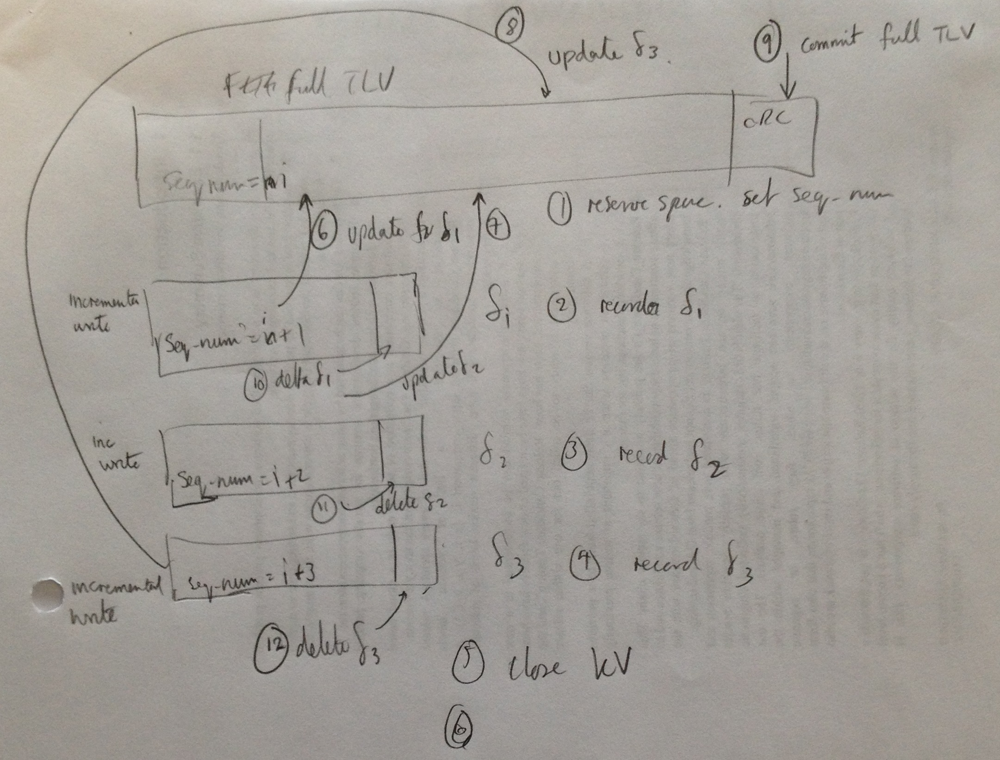

# Configuration Store High Level Design: Design For Removing SRAM Limitation

Author: Simon Hughes

Document Version: 0.01

Date 20161110

# Introduction

## Overview

This document describes the CFSTORE high level design to remove the SRAM Limitation.

- There is a pre-existing CFSTORE [HLD for the API design][CFSTORE_HLD]. Please refer to that document before reading this document.
- The current document describes a new HLD for the implementation of the API with minimal SRAM footprint.
    

## Goals of New Design:

The implementation uses the system heap to store a full SRAM image of all stored KV attributes prior to committing to NV store. 

- When the CFSTORE Flush() operation is performed, the SRAM image is copied to NV store.
- When the CFSTORE Initialize() operation is performed, the NV store KV data image is loaded into to SRAM heap memory which is allocated when the size of the NV store image is determined.
- When the CFSTORE Uninitialize() operation is performed, the SRAM heap memory is deallocated back to the system.
- When the CFSTORE Read() operation is performed, KV data is read from the SRAM image.
- When the CFSTORE Write() operation is performed, KV data is written to the SRAM image.
- Changes to the KV SRAM image (e.g. through write() operations) must be persisted to the NV store using the flush() operation prior to the calling of Uninitialize(), otherwise the changes will be lost.

The limitations of the above scheme are as follows:

- System heap usage is unbounded, and will continue to grow until the system runs out of memory. 
- System heap usage grows as the total size of stored data grows.
- The size of flash store used is limited to the available SRAM that can be dedicated to CFSTORE usage. For example, if 32kB of SRAM is dedicated to CFSTORE KV image use, then only 32kB of the NV store can be used.
  (Note, a larger NV store footprint will occur as Flash Journal uses additional NV storage to maintain multiple versions of attributes).

The goals of the new design and implementation are as follows:

- To reduce the SRAM footprint to 2-4kB.
- For SRAM usage to be bounded, i.e. the implementation should use statically allocated data buffers rather than using the heap.
- To be capable of using a large flash store without being restricted by the amount of SRAM dedicated to CFSTORE.
- To be robust against failures i.e. the stored data should always be left in a recoverable state should a 
  power loss or a software reset occur during a flash write operation.

## Document Structure and Layout

The layout of the document is as follows:

(todo: write the layout section)

  
## Terminology

Please refer to CFSTORE [terminology document][CFSTORE_TERM] for definitions of terminology. For reference, the following terms are used extensively throughout this document.

- CFSTORE: Configuration Store.
- HLD: High Level Design.
- KV: Key Value.
- PU: Program Unit. This is the minimum size data block write that can be programmed into a sector (e.g. the K64F PU size = 8 bytes).
- TLV: Type Length Value.

# Basic Design Overview

## KVs are stored Using Modified Flash Journal

**Figure 1. Flash Journal (modified) is used to support slots of different types and sizes.**

- The design uses a new Flash Journal algorithm (strategy) (see the above figure):
    - KVs are stored as TLVs (similar to a linked list structure) within a slot.
    - The algorithm will have N slots e.g. 4 slots.
    - Slots are of 2 types:
        - Snapshot Slot. This slot contains a complete record of all the KVs in a TLV array. The TLVs used to represent the KVs are called use a TLV format that includes both the key name and value data in the TLV payload.
        - Delta Slot. This slot contains TLVs that have been modified since the creation 
          of the last snapshot. Modified KVs are recorded using the full TLV format for the specifically modified KVs. KVs that have not been modified are not represented in the delta slot.

Slots have the following characteristics:
    
- Slot boundaries are aligned to sector boundaries.
- Slots have meta-data. There is a header at the start of the slot and a tail with CRC/HMAC at the end of the slot (the header and tail are not show in the above figure).
- Slots can be of different sizes. Its advantageous for snapshot slots to be larger than
  delta slots (e.g. snapshot slot = 256kB, delta slots = 16kB) because:
    - The scheme can accommodate devices with mixed block sizes more easily e.g. STM devices with 4x16kB, 3x64kB, 1x128kB, 1x256kB.
      as small sectors can be used for the deltas, and the large sectors can be used to store the entirety of the snapshot data.
    - its desireable that the snapshot slots use the large sectors so the total amount of stored data can be large e.g. 256kB.
- Slots can be made up of multiple smaller sectors. 
    - For example, on the K64F which has a 2kB sector size, a 256kB snapshot slot may be composed of 128x2kB sectors. 
    - The slot may be composed of a set of non-contiguous storage address ranges rather than a one continuous address range. This permits errored sectors to be taken out of service.
- Slots can be made up of 1 large sector. For exmaple, the STM 42x (todo find data), has a 128kB sector which may be used for a snapshot slot.
- Slot sectors are erased at the start of use of the slot. 
- After the erase operation at the start of use, a delta slot will have multiple transactional writes successfully appended to a delta slot. This means that for every 1 erase operation, there can be many write
  operations extending the overall life of the sector beyond 1 erase per write.
    
todo: insert link to Rohits spreadsheet?

        
## KVs Storage Format

### TLV Structure

**Figure 2. Full TLV storage format for KV data.**

The above figure shows the format of the KV full TLV representation i.e. the format that includes both the key name and value data. This is composed of the following elements:

- Header of fixed size, padded so the last byte aligns with a program unit boundary. The header can  be written to flash independently of writing the preceding tail (if a prior TLV exists in the slot) and the following payload data.
- A data payload, padded so the last byte aligns with a program unit boundary. The payload can be written to flash independently of writing the preceding header and following tail. In the above figure, the payload is composed of:
    - Key name. This is the name of the KV attribute.
    - Value data. This is the value data bound to the key name.
- A tail of fixed size, padded so the last byte aligns with a program unit boundary. The tal can be written to flash independently of writing the preceding payload, and the following header of the next TLV (space permitting). 

Note also the following:

- TLVs are of variable length.
- TLVs can be of different types, as indicated by the header TYPE field.
- TLV fields for data types larger than a byte are written in big endian format (network byte order).
- TLVs may cross sector boundaries so that CFSTORE can support KV sizes larger than sector sizes.
- The start of the header, key name, value data and tail data structures on NV store must be aligned with PU boundaries, to facilitate the writing of the TLV components independently of one another.

###  KV TLV Generic Header

**Figure 3. TLV generic header format.**

The above figure shows the generic structure of the TLV header common to all KV TLV representations. The structure and field definitions are described in the following: 

- VERSION field (~4 bits). This field indicates the version of TLV header and data format (version 1 is described in this document).
- RESERVED field (~4 bits). This field is reserved for future use.
- TYPE field (~8 bits). Type = 1 indicates a full TLV representation which includes the key name and the value data. These TLVs may appear in snapshot and delta slots.
- FLAGS field (~16 bits). This field includes permissions, for example, and the definition of the flags is determined by the TLV Type.
- Additional fields are present depending on the value of the Type field.
- PAD. The header is padded so the last byte aligns with a program unit boundary, so that the header can be written to flash independently of writing the preceeding and following journal entries. 

### KV TLV Tail

**Figure 4. KV TLV tail format.**

The above figure shows the TLV tail format including the following fields:

- VALID field (~8 bits). The valid value of the VALUE field is the value programmed after an erase operation. 
  In the case that the erase value is all bits set to 1 and the correct CRC for the TLV is present, then the TLV indicates the TLV is valid. 
  A value of 0x00 in this field would then indicate the TLV is invalid irrespective of the CRC. The delete operation sets the Valid field to the complement of the erase setting. 
  A value of 0x00 in this field would then indicate the TLV is invalid irrespective of the CRC. The delete operation sets the Valid field to the complement of the erase setting. 
  TLVs with the Valid field set to 0 are ignored.
- Reserved1 field (~24 bits). 
- Reserved2 field (~32n bits, for n >=0). This is padding so the Valid field sits within a program unit size block of NV store. 
- CRC field (32 bits). This is the CRC of the TLV.
- Reserved3 field (~32n bits). This is padding so the CRC field sits within a program unit size block of NV store. 

#### Message Authentication Codes as Alternative to CRCs

- The use of HMAC codes rather than CRC can be beneficial:
    - HMAC requires key that should be kept securely. 
    - uvisor MUST be used to manage the keys securely.
    - Consider the scenario A of 1) key being stored in fuse, or HW security module, 2) CFSTORE storing data in on-chip flash. Then HMAC key stored more securely that flash so beneficial to use HMAC codes to protect on-chip flash data.
    - Consider the scenario B of 1) key being stored in on-chip flash, 2) CFSTORE storing data in on-chip flash. Then HMAC key is not stored more  securely than data so its not beneficial to use HMAC codes to protect on-chip flash data.
    - Consider the scenario C of 1) key being stored in on-chip flash, 2) CFSTORE storing data in off-chip flash. Then HMAC key stored more securely that data in off-chip flash so beneficial to use HMAC codes to protect off-chip flash data.
- The design should be flexible enough so the tail CRC code can be replaced with MAC codes
- The purpose of the CRC is for integrity only. However, many data sets can map to the same CRC, leading to the possiblility that the data can be replaced without changing the CRC.
- HMAC codes offer benefits over CRCs: 
    - a hash can offer better CRC collision protection 
    - Options to consider: HMAC SHA-1 (120 bits = 20 bytes), HMAC SHA-256 (256 bits = 32 bytes), HMAC SHA-384 (384 bits = 48 bytes), HMAC SHA-512 (512 bits = 64 bytes), AES CMAC (? bits = ? bytes)
    - the tail needs to be able to change size to accommodate the different size MAC codes.
- This part of the design will be discussed in another document.

    
###  KV TLV Header Type 1: Full TLVs

**Figure 5. TLV type 1 header format for the full TLV representation. Note that figure incorrectly shows Type = 0. **

The fields of the KV header include the following:

- The generic header fields as previousl described in the [KV TLV Generic Header](#kv-tlv-generic-header) section.
- FLAGS field (16 bits). This field is to be specified.
- HLEN field (8 bits). This field specifies the length of the header.
- KLEN field (8 bits). This field specifies the length of the key name field in the TLV payload. It is padded with 0's so the last byte aligns with a program unit boundary, 
  allowing the first part of the TLV (header and key name) to be written in NV store when created/opened for writing independently of the following payload.
- Reserved1 field (~16 bits). 
- VLEN field (32 bits) specifies the length of the KV value data field in the TLV payload.
- KVID (32 bits). This field reports the unique identifier bound to the key name specified in TLV key name part of the payload. The KVID is used in other TLV types to identify a TLV without including the key name.
  The KVID is selected at create time and is unique within the store.
- SEQUENCE_NUMBER (32 bits). This is the KV version number which is incremented each time a new version of the KV is written. The implementation must take into account the possibility that 
  the sequence number counter can wrap. See the next section.
- Pad. The header is padded so the last byte aligns with a program unit boundary. 

#### Wrapping of the SEQUENCE_NUMBER

todo: describe how the sequence number wraps.

- MAX=0xffffffff, Permit MAX/N_SLOT operations per slot. 
- MAX_NUM_KV_ATTRIBUTES = MAX/N_SLOT ~ 1x10^9.
- SEQUENCE-NUMBER-SLOT-START = SEQUENCE-NUMBER for the first journal entry logged in a slot
- check at start of creating new slot:
    - if the SEQUENCE_NUMBER  > (N_SLOT - 1) x MAX/N_SLOT then set SEQUENCE_NUMBER = 0
    - at this point, there should be no entries in the system with seq number in range 0-
- jornal meta data records rotation between slot sequences.
- what about KV thats written once, and then never written again? OK, these get increments when new snapshot get created, so OK.
- if the (SEQUENCE_NUMBER - SEQUENCE_NUMBER_SLOT_START) > MAX/N_SLOT 
    - stop logging journal entries in that slot.
 

## CFSTORE Operations

### Storage of KV Read/Write Locations and Reference Counting

For each open KV descriptor (hkey), the opaque hkey buffer is used by CFSTORE as an implementation storage area:

- The hkey is used to store a cfstore_file_t data structure.
- cfstore_file_t stores:
    - The KVID of the open KV.
    - The KV read location rlocation.
    - The KV write location wlocation.
- The cfstore_file_t form nodes in a the file_list linked list of open files. 
- When a KV is opened multiple times (e.g. by multiple clients each accessing the same KV) then multiple cfstore_file_t entries will appear in the file_list 
  with the same KVID.
- The file_list is used to generate a reference count of the number of open KV descriptors for a particular KV by counting the nodes with the KV KVID appearing in the file_list.
  In the case that a client deletes a KV, the KV is only deleted when the last open KV descriptor using the KV is closed, and the reference count falls to 0.

### Creating a New KV

**Figure 6. Creating a New KV.**

The above figure shows the operations performed to create a new KV.

- Initially, there is a snapshot present which contains {KV1, KV2, KV3, KV4, KV5}. 
- When CFSTORE Create() is called, the key name and size of the KV are specified. 
    - A cfstore_file_t structure is allocated within the hkey buffer, or from a statically allocated SRAM pool of structures.
    - The size of the full TLV representation needed to store the KV is calculated from the supplied data i.e. `size = sizeof(header)+sizeof(tail)+key_name_length+value_data_length)`.
    - The space size for the KV TLV is allocated in the delta slot.
    - The header and the key name part of the payload are written.
    - See (1) in the above figure which shows the creation of the KV6 attribute in the delta slot.
- When CFSTORE Write() is called, the client supplies a data buffer and the length of the data to be written (see (2) in the above figure).
    - CFSTORE writes the data to NV store. The supplied data should be padded to be a multiple of PU size (the minimum write size). If not CFSTORE 
      will write only a multiple of PU bytes.
- When the KV is closed the tail is written in the KV commit the data. 
- Once the KV has been closed it may be opened for writing again. This will cause a new version of the KV TLV to be present in the delta slot.

### Deleting a  KV

**Figure 7. Deleting a  KV.**

The above figure shows the operations performed to delete a KV.

- The last full TLV representation of the KV is found. This may appear in a snapshot or delta slot.
- The VALID field (perviously set to the erase value at during the last sector erase operation) is set to complement of the erase value. The KV TLV then becomes invalid and will be ignored.
- At a suitable point during system operation (e.g. when a CFSTORE Flush() operation is performed) the previous snapshot slot and delta slot(s) are used to create a new snapshot slot. The new snapshot slot contains
  a full representation of all the valid TLVs not including the deleted TLVs. The old snapshot slot will be erased and used to create the next snapshot version at some future point in time. This scheme garbage
  collects the deleted TLVs at the expense of periodically consolidating valid KV TLVs in a snapshot image.
  

### Opening an Existing KV for Reading

- For this operation, its not necessary to log any new entries in the delta slot.
- When an existing KV is opened for reading, the latest version of the KV TLV is found. This may be in the preceding snapshot or delta slots.
    - A cfstore_file_t structure is allocated within the hkey buffer, or from a statically allocated SRAM pool of structures.
- When the client performs a CFSTORE Read() operation, the KV data is read into the supplied buffer from the location indicated by the current value of the rlocation position. 
    - The cfstore_file_t rlocation position is updated after receiving the data from the storage driver.
- When the client performs a CFSTORE Rseek() operation, the cfstore_file_t::rlocaton attribute is updated.
- Multiple readers can read there underlying KV TLV data simulataneously. Each client maintains a cfstore_file_t::rlocaton attribute independent of other clients.
- When the client performs a CFSTORE Close() the cfstore_file_t structure is returned to the client/returned to the pool.

### Opening an Existing KV for Reading/Writing

**Figure 8. Opening an existing KV for reading/writing.**

- For this operation, a new version of the TLV is created in the delta slot.
- When an existing KV is opened for reading and writing, the latest version of the KV TLV is found. 
    - The latest version of the TLV may be found in the previous snapshot (see (1) in the above figure) or in a delta slot. The latest version will have a valid CRC/HMAC code and the latest SEQUENCE-NUMBER.
    - A cfstore_file_t structure is allocated within the hkey buffer, or from a statically allocated SRAM pool of structures.
    - The size of the full TLV representation needed to store the KV is calculated from the supplied data i.e. `size = sizeof(header)+sizeof(tail)+key_name_length+value_data_length)`.
    - The space size for the KV TLV is allocated in the delta slot.
    - The header and the key name part of the payload are written.
    - See (1) in the above figure which shows the opening of a pre-existing KV in a snapshot slot and the creation of the new full TLV representation in the delta slot.
- When the client performs a CFSTORE Read() operation, the KV data is read into the supplied buffer from the location indicated by the current value of the rlocation position. 
    - The cfstore_file_t rlocation position is updated after receiving the data from the storage driver.
    - When the client performs a CFSTORE Rseek() operation, the cfstore_file_t::rlocaton attribute is updated.
- When CFSTORE Write() is called, the client supplies a data buffer and the length of the data to be written (see (2) in the above figure).
    - The cfstore_file_t wlocation position defaults to 0, and cannot be set with a seek operation. It is updated after writing data to storage.
    - CFSTORE writes the data to NV store. The supplied data should be padded to be a multiple of PU size (the minimum write size). If not CFSTORE 
      will write only a multiple of PU bytes.
- Multiple readers/writers can read/write the underlying KV TLV data simulataneously. Each client maintains  and cfstore_file_t::wlocaton attributes independently of other clients.
- When the KV is closed the tail is written in the KV commit the data. See (3) in the above figure. The previous version of the TLV is then invalidated by settin the tail VALID field to the complement of the erase value.
    - When the client performs a CFSTORE Close() the cfstore_file_t structure is returned to the client/returned to the pool.
- Once the KV has been closed it may be opened for writing again. This will cause a new version of the KV TLV to be present in the delta slot (see (4) in the above figure).

### Flush Operation

The CFSTORE Flush() operation does the following:

- The current delta slot is commited by writing the tail of the Flash Journal Slot.
- The oldest snapshot slot is erased in preparation for receiving the new snapshot data.
- The latest versions of valid KV TLVs are found in the latest snapshot and delta slots. A new version is written in the new snapshot so that there will be no deleted TLVs present.
- The new snapshot flash journal tail will be written, committing the snapshot data.

### Synchronous Mode of Operation.

The design supports a synchronous interface implementation.

### Asynchronous Mode of Operation

The design supports an asynchronous interface implementation. The asynchronous KV read operation proceeds as follows:

- On a KV open for read-only access, a KVBUF is attached to the KV file descriptor.
- The KV is found in the lastest snapshot and the value data read into the KVBUF.
- The delta snapshots subsequent to latest snapshot are searched and applied to the KVBUF to yield the current state of the KV value data.
 

### Static SRAM Buffers (KVBUFs)

This design has the following implications regarding the SRAM footprint.
 
- SRAM is not required to support read/write transactions for the following reasons:
    - For a read operation, the ownership of the client read buffer (to receive data) is passed to CFSTORE until the transaction has been completed (either the read data returned, or an error indicated). 
      The buffer (or part thereof) is passed to the storage driver to receive the data, and then returned to the client.
    - For a write operation, the ownership of the client write buffer (with data to store) is passed to CFSTORE until the transaction has been completed (either the data has been written or an error indicated). 
      The buffer (or part thereof) is passed to the storage driver to indicate the data to be written. Once written, ownership of the buffer is returned to the client.
- SRAM is required to support multiple clients concurrently issuing read/write requests:
    - CMSIS storage driver transactions have to be serialised i.e. only 1 outstanding transaction can be outstanding at any time, and the transaction has to completed before another transaction initiated. 
    - For an open KV, there may be an associated statically allocated SRAM buffer known as a KVBUF for queueing read/write transactions to the storage driver.
    - The KVBUF is used to queue a client request e.g.:
        - For storing context data for a future transaction until it can be issued to the storage driver.
        - For storing completion/event notification data. When CFSTORE is notified of the completed transaction by the storage driver, 
          the original request is found in the queue so that it can be appropriately completed to the CFSTORE client.
- For example, the KVBUF may be ~16-32 bytes, and there may be ~64 KVBUFs. So the typical SRAM footprint is ~2kB. 
- Dimensioning of the SRAM buffer should take into account:
    - the size of the flash optimal program unit (1024 bytes on K64F)
    - the size of the flash program unit (8 bytes on K64F) i.e. the KVBUF size should be a multiple of the program unit.
    - The total SRAM footprint.
    - The maximum number of concurrently open KVs.
  

### Error Handling

This section describes the error handling incorporated into the design.

#### ProgramData() to a Particula Sector Fails.

In the case that the programming of data to a particular flash sector fails, the following error recovery procedure is used:
- the procedure is currently unknown/unspecified.
- See the [Wear Levelling](#wear-levelling) section for further discussion. 

# Enhanced Design Features

This section describes features that can be added to the basic design to enhance operation and performance. Additional features includes:

- Write location seek support for setting the write location within a file.

## Write Location Seek Support

The CFSTORE API specification has the limitation that the write locaion does not support seeking:

- When a file is opened for writing, the write location (wlocation) is set to 0, i.e. to the beginning of the KV value data.
- As data is written to the KV value data field, wlocation is incrementally updated reflecting data that has been written. No Wseek() method exists in the CFSTORE API, so wlocation cannot be changed i
  independently of write operations.
- When a file is opened for reading, the read location (rlocation) is set to 0, i.e. to the beginning of the KV value data.
- As datat is read from the KV value data field, rlocation is incrementally updated reflecting data that has been read. 
- rlocation can be set to a new offset using the Rseek() method in the CFSTORE API. 

This inability to seek the wlocation means there is a mismatch between the CFSTORE API and the behaviour of a traditional POSIX file API, 
which the feature described in this section seeks to address. 

**Figure 9. Type 2 TLV Header format incremental write operations.**

Seeking wlocation is implemented by defining a new TLV type for incremental writes (Type = 2 header). Figure 9 shows the fields in the header, where the definition of the following 
fields has been defined previously in the [KV TLV Header Type 1](#kv-tlv-header-type-1) section:

- Version field (~4 bits). 
- Reserved field (~4 bits). 
- Type field (~8 bits).  
- Flags field (~16 bits).  
- VLEN (32 bits). 
- KVID (32 bits).
- SEQUENCE_NUMBER (32 bits).
- PAD.

The wlocation field is defined as follows:

- WLOCATION (32 bits). The first byts of the incremental write payload data is written at offset WLOCATION from the start of the KV value data.

**Figure 10. Sequence of incremental write operations.**

Figure 10 illustrates how the incremental write TLV is used in conjunction with the full TLV to support seeking wlocation:

- When a KV is opened for reading and writing, space for a new full TLV representation of the KV is reserved in the delta slot. See (1) in the figure. 
    - Upon opening, the header fields, key name and size of the KV are known, so these data can be created and stored in flash. The setting of the 
      header TLV length fields means the TLV can be "walked over" to the next TLV's (e.g. the incremental write TLVs) so that new TLVs can be written
      in the journal, before the full TLV tail CRC has been written.
    - The header SEQUENCE_NUMBER is set to i.  
- The subsequent write operations are recorded in the delta slot with incremental write TLVs. 
    - The incremental write TLVs (write deltas) are stored after the full TLV described in the previous point.
    - The header SEQUENCE_NUMBER is set to j where j > i.  
    - The cfstore_file_t::wlocation variable is updated accordingly after each incremental write.
    - The above figure shows the 3 incremental write operations at (2), (3) and (4). The sequence numbers are ordered such that j4 > j3 > j2 > i.
    - Multiple writers can be writing data to the same KV. Each writer contributes incremental writes independently, but they are all used to create a new version of the full TLV data.
- Read operations first read the original KV TLV snapshot data into the client receive buffer. The delta write operations for this KV are then applied ontop of the original TLV data into the client receive buffer. 
  This re-creates the current version of the value data, which is returned to the client.
- When the TLV is closed ((see (6) in the above figure, no more writes to be made), the new state of the TLV is recorded in the space allocated for the full TLV. In a loop:
    - A data window (e.g. 256 bytes, a multiple of the PU size) is read from the snapshot TLV into an SRAM buffer, the first data window being read from the start of the TLV data.
    - The incrementatal writes updating value data inside the data window are applied to the buffer.
    - The buffer is then written to the full TLV.
    - The loop is repeated for the next data window worth of data until the full TLV data payload has been written.
    - Once the payload has been written, the full TLV tail is written committing the new version of the TLV. The incremental write TLVs are then deleted.
- With reference to the above figure, events (6), (7) and (8) show the incremental write data being recorded in the full TLV. The CRC is then written  
  for the full TLV (9) committing the data. The incremental TLVs are then deleted by setting the VALID field in the tails to 0x00 (see events (10), (11) and (12)).
  
The above operation has been specified such that if device experienced a power failure at any point during the sequence of operations then the KV data stored in flash remains in a consistent state
from which the device software can recover the data. 

If the power fails during the above operation then upon restarting the system falls back to the latest version of the full TLV representing the KV data. 
The latest version is the one with the most recent sequence number. 

- If the power fails prior to event (9) then the system will fallback to the previous full TLV version e.g. the version stored in the last snapshot slot. 
  The incremental write TLVs will be ignored (they may be deleted on CFSTORE initialisation) and the 3 data incremental write operation will be lost.
- If the power fails after event (9) but prior to deleting the incremental write TLVs, then the system will fallback to using the new full TLV version created with the incremental write deltas. The 
  undeleted incremental write TLVs will be ignores (they may be deleted on CFSTORE initialisation).

Note that at initialisation, undeleted incremental write TLVs in a delta slot may be deleted.

## Slots as Ring Buffers

- starting at variable location.
- finding the first TLV in a slot
- wrapping 

todo: in next revision relax this constraint e.g. with the following changes:

- relax the constraint that the delta TLV is fixed size of 256 bytes.
- the delta TLV is of minimum of program unit bytes in size.
- have a cookie field in the header.
- the delta slot is used as a ring buffer.
- rather than the first delta TLV start at a random location selected from one of the (sizeof delta slot)/(sizeof fixed delta TLV block ~256bytes) locations, 
  have N~(sizeof delta slot)/(sizeof KVBUF) so N~64 predefined possible locations.
- one subslot position is selected at random when writing the first KV to a delta slot. 
- The location of the first TLV in a delta slot is caches in 
  to find the first delta TLV 
  
- the first delta block writing in a slot is written at a random location within the slot so as not to excessively wear the 
  flash at the start of the associated sector. To do this: 
    - delta blocks have a flag indicating this is the first one to be written in the delta slot.
    - delta blocks are of fixed size e.g. KVBUF, multiple of the program unit. They delta slot can be searched 
      from the start of the slot by looking for the looking for the first delta TLV flag at the 
      boundaries which 

#### Delta TLV First bit

todo: this section describes the operation of the Delta TLV First bit

- A Scheme for minimizing wear at the start of a slot.
- delta slot used as a ring buffer of delta TLVs.

##  Wear Levelling

This feature is currently under development. Thoughts include:

- When a program data operation to a sector fails, the sector is marked bad and taken out of service.
    - Bad sectors are recorded in flash journal meta data.
- The max KV attribute size is restricted to N x sector-size e.g. n = 2, or n = 4. On K64F, the max attribute size would be 4kB (N=2) or 8kB (N=4).
- A flash journal slot is composed of a set of storage blocks. 
    - A block corresponds to N sectors forming a physical address range with no holes (i.e. contiguous). 
    - A block contains no bad blocks.
    - If a bad sector is detected in a block, the block is split into 2 sub-blocks, with the bad block missing form both sub-blocks.
        - The orignal block is detached from the slot.
        - The bad sector is recorded in the journal meta data.
        - The 2 sub-blocks are attached to slot and managed like the other blocks.
- Optionally, a pool of sectors is set aside to replace bad sectors in slots, maintaining a slots capacity.

# References 

* The [CFSTORE Product Requirements][CFSTORE_PRODREQ]
* The [CFSTORE Engineering Requirements][CFSTORE_ENGREQ]
* The [CFSTORE High Level Design Document][CFSTORE_HLD]
* The [CFSTORE Low Level Design Document][CFSTORE_LLD]
* The [CFSTORE Terminology for definition of terms used in CFSTORE documents][CFSTORE_TERM]

[CFSTORE_PRODREQ]: doc/design/configuration_store_product_requirements.md
[CFSTORE_ENGREQ]: doc/design/configuration_store_requirements.md
[CFSTORE_LLD]: doc/design/configuration_store_lld.md
[CFSTORE_HLD]: doc/design/configuration_store_hld.md
[CFSTORE_TERM]: doc/design/configuration_store_terminology.md
[KEIL_CMSIS_DRIVER]: http://www.keil.com/pack/doc/CMSIS/Driver/html/index.html
