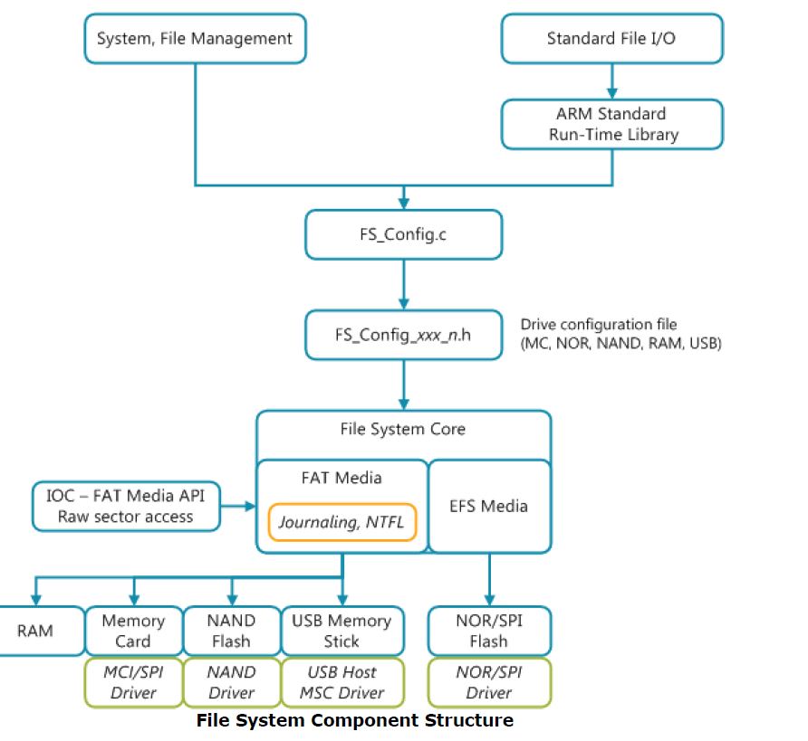

# Proposal for Storage/Configuration Store Summit Agenda

Author: Simon Hughes

Document Version: 0.02

Date: 20161202

#  Introduction

This document proposes a set of key questions for the Dec 2016 Storage Summit Agenda (~7 Dec 2016). The following participants are attending:

- Daniel Benor
- Simon Ford
- Sam Grove
- Simon Hughes
- Erez Landau
- Amyas Philips
- Marcus Shawcroft
- Sam Taylor
- ?

The questions can be summarised as follows:

- [Storage Traits](#storage-traits)
- [Storage Properties and Introspection](#storage-properties-introspection)
- [CMSIS Storage versus CMSIS Flash v2.0](#cmsis-storage-versus-cmsis-flash)
- [mbedOS Support Storage Drivers: How to Progress STM Drivers and mtd-sdcard-raw](#storage-drivers)
- [Why should CMSIS be *THE* Storage Driver API?](#cmsis-storage-drivers-standardization)
- [Storage Stack Architecture/Composability, Storage Connectivity](#storage-stack-architecture)

# Key Questions

##  Storage Traits

Storage traits: concept and terminology:

- Storage traits relate to attributes of the underlying storage which a storage client can use to make informed decisions regarding use.
- Traits could include:
    - storage type e.g. Write Once Read Many(WORM), fuse, EEPROM, ROM, battery backed SRAM, whether it has tamper-proof protection.
    - physical attributes of the storage e.g.  whether the store is on-chip or off-chip, and therefore more appropriate for key storage.
    - storage security attributes e.g. whether a store has ACLs, ability for a secure context to enable/disable write protection.
    - storage device attack prevention/detection support e.g. hardened against software attacks, side channel attacks, board attacks etc.

Question: is this as everyone expects?

Observation: This is part of the CMSIS Storage API.

    
##  Storage Properties and Introspection

Introspection differentiates the CMSIS storage API from the CMSIS Flash API.

- Needed so that a storage client can query a storage driver to find out essential details for working with the device.
    - How many sectors are does the driver manage?
    - Are sectors composed into larger blocks and if so, how big are the blocks?
    - For a sector:
        - how long is it?
        - what is the program unit size/page size i.e. the minimum size of a write to that sector?
        - what is the erase bit setting?
- What is an optimal size for write buffers submitted to the storage API? 
    - should the buffers be padded, or rounded to the nearest program unit/page size?
    

##  Storage Interface Name (CMSIS Storage versus CMSIS Flash v2.0)

Question: Why did Keil elect to market a new name (CMSIS Storage Driver) for the new flash interface rather than CMSIS Flash v2.0? 

Answer: unknown.

##  mbedOS Support Storage Drivers: How to Progress STM Drivers and mtd-sdcard-raw

Questions: 

- Should the STM CMSIS Storage drivers submitted as an mbedOS pull request be accepted into mbedOS?
    - If not, then what needs to be done to make this code acceptable to mbedOS?
    - How are partners expected to contribute flash drivers with introspection i.e. expose knowledge of number of sectors, sizes, page sizes etc.?
- Should the mtd-sdcard-raw driver be accepted into mbedOS?
   

##  Why should CMSIS be *THE* Storage Driver API?

Question: Why should CMSIS be *THE* Storage Driver API?

Answer:

- There was ARM initiative to standardize on one (OS agnostic) Driver API specification so Partners were expected to 
  contribute a single set of drivers for their SoC, rather than having to duplicate effort and contribute drivers to both Keil OS and mbedOS.
  

##  Storage Stack Architecture/Composability, Storage Connectivity

- What is the composition of the various drivers e.g. when a NAND flash part is going to sit ontop of SPI/I2C/MCI drivers?
- What are the reference compositions in mbedOS for puting various things together?
- Is this statement correct?: "Currently there is no mbedOS storage stack architecture".
    - Look at the filesystemlike.h interface; the sdcard class hierarchy sits onto of this.
    - What's the networking stack so that you can fit things together?
    

**Figure 1. Keil filesystem component software architecture.**

