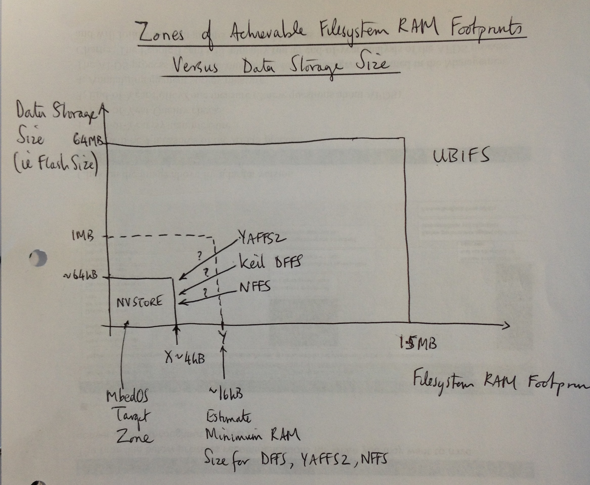
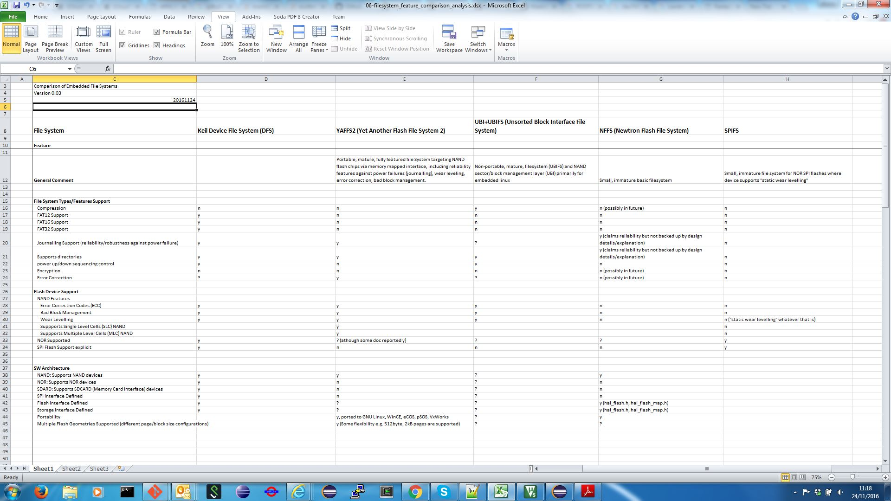
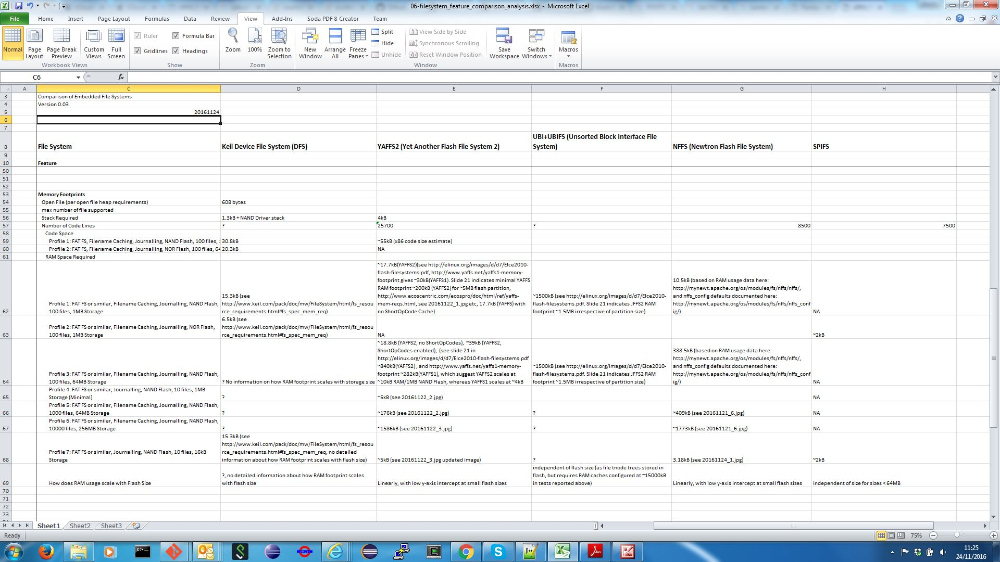
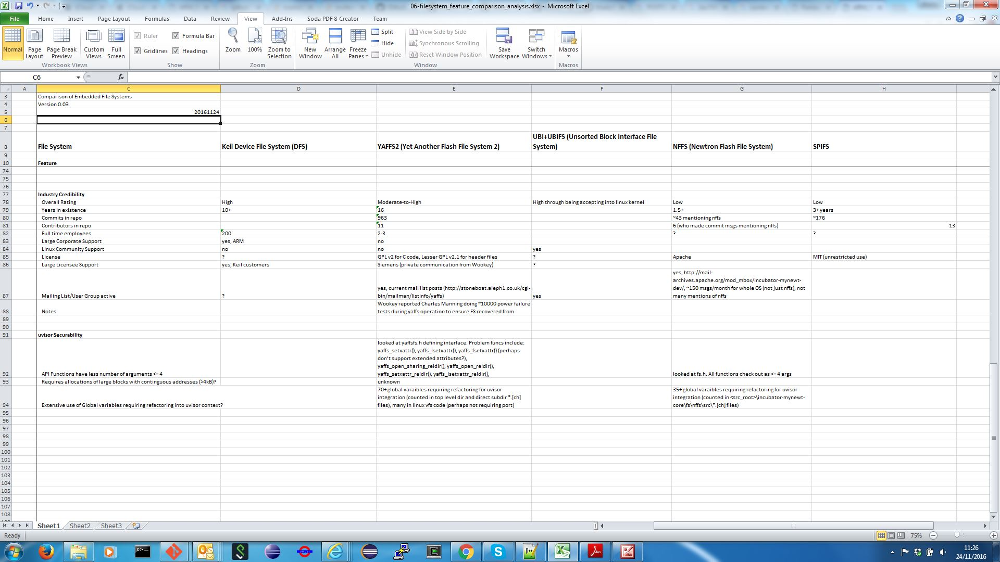

# Filesystem Feature Comparison Analysis for mbedOS Storage Solutions

Author: Simon Hughes

Document Version: 0.01

Date: 20161124

Status: DRAFT

#  Introduction

This document describes a filesystem (FS) feature analysis with a view to selecting one for inclusion in mbedOS. The filesystems considered are as follows:

- Keil Device Flash File System (DFFS).
- Yet Another Flash File System (YAFFS) v2.0, a portable embedded FS.
- Newtron Flash File System (NFFS), which is part of the Apache Newtron IoT OS.
- SPI Flash File System (SPIFFS), a filesystem for SPI NOR flash.
- Unsorted Block Interface File System (UBIFS) widely used within the embedded linux community. This is considered for comparative purposes as it's typically used for large flash stores (64MB+).

The key requirements are considered to be the following:

- NOR aware filesystem with journaling (robustness against power failure). An important IoT design case is for the filesystem to be mounted on an external SPI NOR flash ~0.5-4MB in size e.g.
    - [Spansion 8Mbit SPI NOR][FLASH_SPANSION_01] availble in volume @20p each.
    - [Microchip 16Mbit SPI NOR][FLASH_MICROCHIP_01] reportedly used by an IoT lighting specialist.
    - The off-chip store is envisaged as a general purpose store e.g. as a file store, for firmware images, application data, logs, etc.
- NAND aware filesystem with journaling (robustness against power failure). Note the NAND flash write times are typically much shorter than NOR, and the filesystem should support this variation.
- Bad block management. This is especially necessary for NAND parts, less so for NOR parts but still important.
- Wear levelling. This is relevant for both NAND and NOR parts.
- Error Correction Codes (EEC). This is especially relevant for NAND flash (write distrubance) but also relevant for NOR.
- A 2-4kB RAM footprint.
- A minimal POSIX API.

It is currently envisaged that there will be a small (16-64kB) on-chip store (NVSTORE) with minimal functionality.

##  Summary Conclusions

The conclusions of the analysis can be summarised as follows:

  
- The Keil DFFS and YAFFS are currently considered to be the best candidates.
- YAFFS2 is mature, credible, portable filesystem targeted at NAND (has bad block management) but with NOR support too, wear levelling and EEC. There is evidence that robustness testing against power failure has been performed, 
  and it has been tested against other FS's and [performs reasonably well][FFS_PERFORMANCE_TESTING_01]. 
- Keil DFFS is credible, well architected, well documented, has NAND and NOR support, bad block management, wear levelling and EEC.
- It’s questionable whether the DFFS/YAFFS RAM footprint can scale from an estimated minimum of Y~16-20kB (based on the documented data structure sizes, see figure below) down to 2-4kB (the RAM footprint requirement). 
  YAFFS2 documentation suggests its possible, whereas the Keil documentation is insufficiently detailed to know.
- Irrespective of the difference between NOR and NAND flash (e.g. random versus block read access, write access times), both Media Technolody Devices (MTD) are present within the system with the same program()/erase() block sematics at
  the driver level. It should be up to the system designer to enable/disable filesytem storage features (bad block management, EEC, wear levelling) irrespective of the MTD type.
    - SPI NOR parts are characterised by being byte readable, and sometime byte writable e.g. [Spansion SPI NOR flash part][FLASH_SPANSION_01] or the [Microchip SPI NOR flash part][FLASH_MICROCHIP_01].
    - SPI NAND parts are characterised by being page readable and writable e.g. [Micron SPI NAND flash part][FLASH_MICRON_02_SPI_NAND].
    - eMMC NAND parts are characterised by being page readable and writable e.g. [Micron eMMC NAND flash part][FLASH_MICRON_01_EMMC_NAND].

    

**Figure 1. Zones of achievable filesystem RAM footprint size versus data storage size.**

The figure above shows the following:

- The figure characterises filesystem performance with respect to RAM footprint (x-axis) for a given data storage (flash) size (y-axis).
- Typically, the filesystem RAM footprint depends linearly on data (flash) storage size, with a non-zero RAM footprint for very small data storage sizes. 
    - The rule of thumb is ~1-2kB of RAM is required per MB of data flash storage. 
    - The linear relationship results from storing in-memory representations of files (e.g. using tries) for wear levelling and garbage collection on (NAND type) block stores.
      This is because:
        - The file store is divided into fixed size pages (e.g. 256, 512bytes, increasing to 2kB, 4kB for 256MB+ stores) which are used to store file data.
        - The flash blocks are referenced with a blockId. The size of the blockId (in bits) increases depending on the page size and the size of the store e.g.   
            - For a 1MB store with 256byte pages there will be (1x1024x4) pages requiring a blockID field with 12bits. The memory footprint will be (1x1024x4)x12/(8bitsx1024) = 6kB. (A)
            - For a 64MB store with 512byte pages there will be (64x1024x2) pages requiring a blockID field with 17bits (rounded up to 18 bits). The memory footprint will be (64x1024x2)x18/(8bitsx1024) = 288kB.
            - As the store size grows the page size increases so that the number of blocks doesn't grow expontially, 
              and hence the approximate "linear" relationship arises. Note that scaling from the 1MB store to 64MB i.e. 6kB (from A) x 64 = 384kB i.e. ~288kB, approximately linear behavior.
              Note also that increasing the page size potentially increases the amount of wasted space when storing small files.
    - This linear relationship is unacceptable at large flash sizes (64-256MB) in which case memory caches are limited to ~1.5MB RAM, and little used trie data structures are placed on the block store for later retrieval.
- The target performance zone for mbedOS is shown in the bottom left hand corner of the plot, labelled NVSTORE. This a minimal store holding ~16-64kB data using less than X~4kB RAM. 
- From the documentation, YAFFS2 and Keil DFFS (with the required features enabled) can scale down to ~16kB RAM footprint for 10-100 files. The memory usage scales linearly with flash size, and are shown 
  in the middle area of the plot.
- For flash sizes beyond 64MB, UBIFS provides a better solution as the RAM footprint remains independent of flash size at about ~1.5MB (configurable). Hence UBIFS is shown to the upper right of the plot for comparison purposes.

**Figure 2. Keil filesystem component software architecture.**

The following conclusions relate to the filesystem-storage architecture:

- The Keil DFFS storage stack appears well architected with clear APIs for flash buses (`CMSIS_spi.h`, `CMSIS_i2c.h`, `CMSIS_mci.h`) and clear APIs for NOR/NAND flash 
  (`CMSIS_flash.h`, `CMSIS_storage.h`). This means the filesystem, storage driver and bus driver software stack can be composed in a flexible way.
  A filesystem can be mounted on (any of) NAND/NOR/SDCARD flash over (any of) SPI/I2C/MCI/memory-mapped buses. See the above figure for how Keil achieve this.
  This architecture is crucial to partitioning the problem space, decoupling the file system implementation from the storage driver interface,
  so that:
    - There's a clear demarcation defining the software development responsibilities for the ecosystem, minimizing duplication of effort i.e. SoC vendors develop the SoC SPI/I2C/MCI drivers, flash part vendors develop the SPI/I2C/SDCard flash/storage
      protocol drivers and the OS team develop the common storage and device driver subsystems.
    - The large storage problem can be divided into smaller parts and then into engineering projects that can be progressed in parallel with relative independence (loose coupling). SoC Vendors, spi flash part vendors 
      and the OS team can progress independently at scale.    
- mbedOS currently **does not have a storage architecture with well defined and agreed APIs** allowing the storage software stack to be composed in a flexible way. There is tentative alignment around `CMSIS_storage.h`
  but this is currently not being promoted to partners as the storage driver interface to implement. Resolving these issues is important for making progress as the filesystem depends on an agreed storage API, for example. 
- Note that the above figure of the Keil filesystem components software architecture only shows the journaling feature can be layered over the NAND flash devices. Journaling is stil required for NOR devices too, to 
  provide robustness against power failure during filesystem writes.
  

##  Recommendations

The recommended next steps are as follows:

- Port Keil DFFS to K64F/mbedOS and accurately determine the minimum RAM footprint and code size to manage 16kB of on-chip flash. 
    - The port should include:
        - FAT32 with journaling support.
        - NAND support.
        - Filename caching turned off.
        - Bad block management support enabled (minimal RAM footprint configuration).
        - Wear levelling support enabled (minimal RAM footprint configuration).
        - EEC support enabled (minimal RAM footprint configuration).
    - Keil should be approached for test data showing the FAT32 journaling support is robust against power failures. 
    - Keil should be queried on why the journaling support is available in Embedded File System (EFX) for NOR flash.
- Port YAFFS2 to K64F/mbedOS and accurately determine the minimum RAM footprint and code size to manage 16kB of on-chip flash. 
    - The port should include:
        - Native file system type with journaling support.
        - NAND support (implicit).
        - ShortOpCode feature disabled.
        - Bad block management support enabled (minimal RAM footprint configuration).
        - Wear levelling support enabled (minimal RAM footprint configuration).
        - EEC support enabled (minimal RAM footprint configuration).
        - Compile out all API support other than basic POSIX file API functions e.g. creat(), open(), close(), read(), write(), unlink(), fsync(), etc.
    - The YAFFS community should be approached for test data showing the solution is robust against power failures.
      The YAFFS Robustness and Testing document suggests this work has been done.
- From the porting work carried out above, select a filesystem for further investigation.
    - Evaluate how the filesystem may be integrated with uvisor and mbed-tls.
    - Prototype the filesystem on external SPI NOR flash e.g. [the Microchip part][FLASH_MICROCHIP_01]. Evaluate/define a SPI protocol driver model that vendors
      can implement for their SPI flash driver without implementing a SPI bus driver.    
        - It's recommended that protocol drivers are used to encapsulate part specific command sets (e.g. for vendor X's SPI NOR flash commands).
    - If insufficient data has been sourced from filesytems developers, perform in-house power failure robustness testing.
- It's not recommended to do the porting analysis for NFFS as there is currently no support for wear levelling, EEC and bad block management.
- It's not recommended to do the porting analysis for SPIFFS as this solution lacks the maturity and credibility of the other solutions.
- If a candidate filesystem can scale down to ~2-4kB then consider whether CFSTORE is still required.
- Notwithstanding the above analysis, the most likely scenario remains that both a minimal CFSTORE (for 16-64kB data storage on-chip key storage) and a more scalable filesystem both have a place in mbedOS.
- A modified version of the Keil filesystem storage architecture (or similar) should be considered as a candidate for the mbedOS storage software architecture.
    - It's recommended that a storage architecture is defined as soon as possible.
    - It's recommended that driver interface methods should have driver handle per instance rather than separate driver instances, for easier dynamic bindings.
    - It's recommended that system/bus resources (e.g. bus pin allocations) abstracted from drivers into a configuaration store to make drivers as generic as possible.

#  Filesystem Excel Spreadsheet

The [filesystem feature analysis spreadsheet][FS_XLS] is broken down into the following main sections:

- [Filesystem Features, Flash Device Support and Software Architecture](#filesystem-features-flash-device-support-and-software-architecture) 
- [Filesystem Memory Footprints](#filesystem-memory-footprints)
- [Industry Credibility and Uvisor Securability](#industry-credibility-and-uvisor-securability)

See the following section for more details.

##  Filesystem Features, Flash Device Support and Software Architecture

**Figure 3. Filesystem Features, Flash Device Support and Software Architecture**

##  Filesystem Memory Footprints

 
**Figure 4. Filesystem Memory Footprints.** 

##  Industry Credibility and Uvisor Securability

**Figure 5. Industry Credibility and Uvisor Securability**

#  References 

* The [Filesystem Feature Analysis Spreadsheet][FS_XLS].
* The [Flash Filesystem Benchmark Analysis][FFS_PERFORMANCE_TESTING_01] performed by Michael Opdenacker.
* The [Microchip SPI NOR flash part][FLASH_MICROCHIP_01].
* The [Spansion SPI NOR flash part][FLASH_SPANSION_01].
* The [Micron SPI NAND flash part][FLASH_MICRON_01_EMMC_NAND].
* The [Micron eMMC NAND flash part][FLASH_MICRON_02_SPI_NAND].

[FS_XLS]: docs/filesystem_feature_comparison_analysis.xlsx
[FFS_PERFORMANCE_TESTING_01]: http://elinux.org/images/d/d7/Elce2010-flash-filesystems.pdf
[FLASH_MICROCHIP_01]: http://ww1.microchip.com/downloads/en/DeviceDoc/20005262A.pdf
[FLASH_MICRON_01_EMMC_NAND]: http://datasheet.octopart.com/MTFC2GMVEA-0M-WT-Micron-datasheet-14049759.pdf
[FLASH_MICRON_02_SPI_NAND]: http://datasheet.octopart.com/MT29F1G01AAADDH4-IT:D-Micron-datasheet-11572380.pdf
[FLASH_SPANSION_01]: http://www.farnell.com/datasheets/1766170.pdf?_ga=1.197494569.786143889.1480010248
