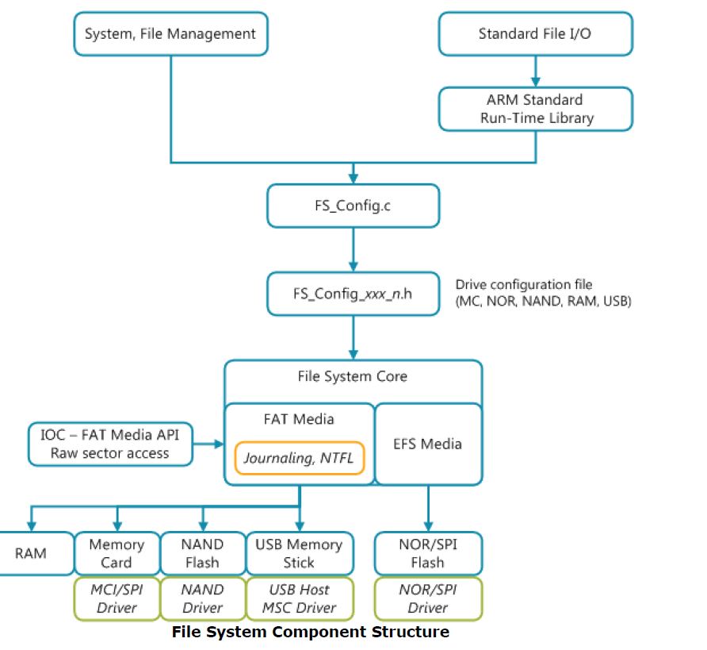

# File System Feature Comparison for MbedOS Storage Solution

Author: Simon Hughes

Document Version: 0.01

Date: 20161124

Status: DRAFT

#  Introduction

This document describes a feature analysis of IoT file systems view to selecting one for inclusion in mbedOS. The filesystems considered were:

- Keil Device Flash File System (DFFS).
- Yet Another Flash File System (YAFFS) v2.0, a portable embedded FS.
- Newtron Flash File System (NFFS), which is part of the Apache Newtron IoT OS.
- SPI Flash File System (SPIFFS). 
- Unsorted Block Interface File System (UBIFS) widely used embedded linux FS for large storage.

The key requirements (features) of the flash file system are considered to the following:

- NAND aware filesystem with journaling (robustness against power failure).
- Bad block management.
- Wear levelling.
- Error Correction Codes (EEC). 
- 2-4kB footprint, 
- minimal POSIX API.

##  Summary Conclusions

The conclusions of the analysis can be summarised as follows:

  
- There are file system alternatives available (Keil DFFS and Yaffs having the features required).
- YAFFS2 is mature, credible, portable, targeted at NAND and has bad block management, wear levelling and EEC. There is evidence that robustness testing against power failure has been performed, 
  and it has been tested against other FS's and performs reasonably well.  
- Keil DFFS is well credible, well architected, well documented, has NAND support, bad block management, wear levelling, EEC
- It’s questionable whether the DFFS/YAFFS RAM footprint can scale from an estimated minimum of X~16-20kB (based on the documented data structure sizes) down to 2-4kB (the RAM footprint requirement). YAFFS2 documentation suggests its possible, Keil documentation is insufficiently detailed to know.

**Figure 1. Zones of achievable filesystem RAM footprint size versus data storage size.**

The figure above shows the following:

- The figure shows a plot of filesystem performance lies with respect to the RAM footprint (x-axis) for a give size of data storage size (flash size) (y-axis).
- Typically filesystems have a RAM footprint size depending linearly on data (flash) storage size, but with a non-zero RAM footprint for very small data storage sizes. 
    - A rule of thumb is that 1-2kB of RAM is required per MB of data flash storage. 
    - This relationship results from having to store in-memory representations of files (e.g. using tries) needed for wear levelling and garbage collection on (NAND type) block stores.
    - This linear relationship is unacceptable at large flash sizes (64-256MB) in which case memory caches are limited to ~1.5MB RAM, and little used trie data structures are placed on the block store for later retrieval.
- The target performance zone for mbedOS is shown in the bottom left hand corner of the plot, labelled NVSTORE. This a minimal key store of holding ~16-64kB data using less than X~4kB RAM. 
- From the documentation, YAFFS2 and Keil DFFS (with the required features enabled) can scale down to ~16kB RAM footprint for 10-100 files. The memory usage scales linearly with flash size, and hence are shown 
  in the middle area of the plot.
- For flash sizes beyond 64MB, UBIFS provides a better solution as the RAM footprint remains independent of flash size at about ~1.5MB (configurable). Hence UBIFS is shown to the upper right of the plot.

**Figure 2. Keil filesystem component software architecture.**

The following conclusions relate to the filesystem-storage architecture:

- The Keil DFFS storage stack appears well architected with clear APIs for flash buses (`CMSIS_spi.h`, `CMSIS_i2c.h`, `CMSIS_mci.h`) and clear APIs for NOR/NAND flash 
  (`CMSIS_flash.h`, `CMSIS_storage.h`) so the filesystem, storage driver and bus driver software stack can be composed in a flexibly way.
  A filesystem can be mounted on (any of) NAND/NOR/SDCARD flash over (any of) SPI/I2C/MCI/memory-mapped buses.
  This architecture is crucial to partitioning the problem space, decoupling the file system implementation from the storage driver interface,
  so that:
    - A large problem can be divided into smaller parts for engineering work packages that can be progressed in parallel.
    - There is a clear demarcation or responsibilities between the software that should be developed by the SoC vendors (SPI/I2C/MCI drivers), flash part vendors (SPI/I2C/SDCard flash/storage drivers) and the OS team 
      (common storage subsystem framework component, portable file system).
- mbedOS currently does not have a storage architecture with well defined and agreed APIs allowing the storage software stack to be composed in a flexibly way. There is tentative alignment around CMSIS_storage.hThis
  but this is currently not being promoted to partners as the storage driver interface to implement. This is a significant impediment to making progressed as the filesystem depends on an agreed storage API, for example. 
  mbedOS urgently needs a complete storage stack architecture. 
  

##  Recommendations

The recommended next steps are as follows:

- Port Keil DFFS to mbedOS and accurately determine the minimum RAM footprint and code size to manage 16kB of on-chip NAND flash. 
    - The port should include:
        - FAT32 with journaling support.
        - NAND support
        - Filename caching turned off.
        - Bad block management support enabled.
        - Wear levelling support enabled.
        - EEC support enabled.
    - Keil should be approached for test data demonstrating the FAT32 journaling support is robust against power failures, or conduct in-house testing to verify.
    - Evaluate how DFFS may be integrated with uvisor and mbed-tls.
- Port YAFFS2 to mbedOS and accurately determine the minimum RAM footprint and code size to manage 16kB of on-chip NAND flash. 
    - The port should include:
        - Native file system type with journaling support.
        - NAND support (implicit).
        - ShortOpCode feature disabled.
        - Bad block management support enabled.
        - Wear levelling support enabled.
        - EEC support enabled.
        - Compile out all API support other than basic POSIX file API functions e.g. creat(), open(), close(), read(), write(), unlink(), fsync(), etc.
    - YAFFS community should be approached for test data demonstrating the solution is robust against power failures, or conduct in-house testing to verify.
      YAFFS Robustness and Testing document suggests this work has been done.
    - Evaluate how YAFFS2 may be integrated with uvisor and mbed-tls.
- It's not recommended to do the porting analysis for NFFS as there is currently no support for wear levelling, EEC and bad block management.
- It's not recommended to do the porting analysis for SPIFFS as this solution is for NOR flash.
- If a candidate filesystem can scale down to ~2-4kB then CFSTORE is probably not required.
- Notwithstanding the above analysis, the most likely scenario remains that both a minimal CFSTORE (for 16-64kB data storage on-chip key storage) and a more robust FS both have a place in mbedOS.
- A modified version of the Keil filesystem storage architecture should be considered as a candidate for the mbedOS storage software architecture.

#  Filesystem Excel Spreadsheet

The [filesystem feature analysis spreadsheet][FS_XLS] is broken down into the following main sections:

- [Filesystem Features, Flash Device Support and Software Architecture](#filesystem-features-flash-device-support-and-software-architecture) 
- [Filesystem Memory Footprints](#filesystem-memory-footprints)
- [Industry Credibility and Uvisor Securability](#industry-credibility-and-uvisor-securability)

See the following section for more details.

##  Filesystem Features, Flash Device Support and Software Architecture

**Figure 3. Filesystem Features, Flash Device Support and Software Architecture**

##  Filesystem Memory Footprints

 
**Figure 4. Filesystem Memory Footprints.** 

##  Industry Credibility and Uvisor Securability

**Figure 5. Industry Credibility and Uvisor Securability**

#  References 

* The [Filesystem Feature Analysis Spreadsheet][FS_XLS]

[FS_XLS]: doc/filesystem_feature_comparison_analysis.xlsx
